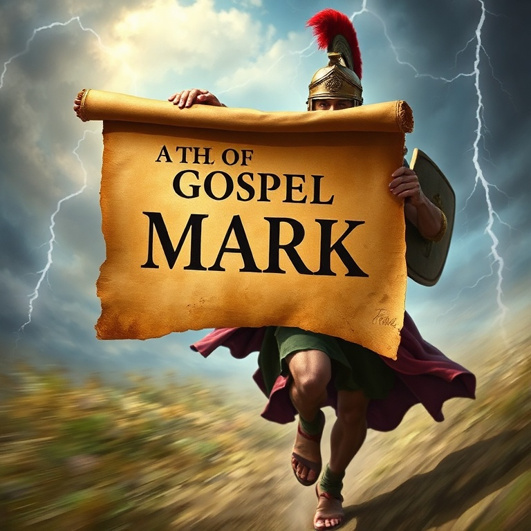
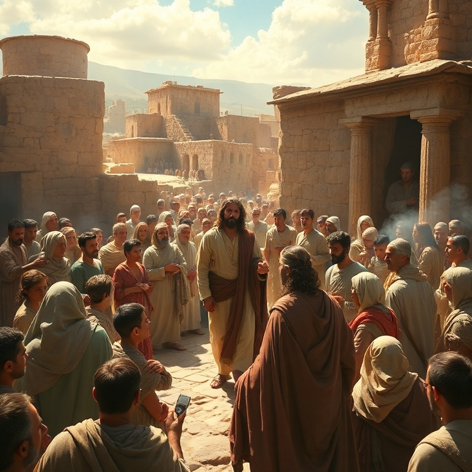
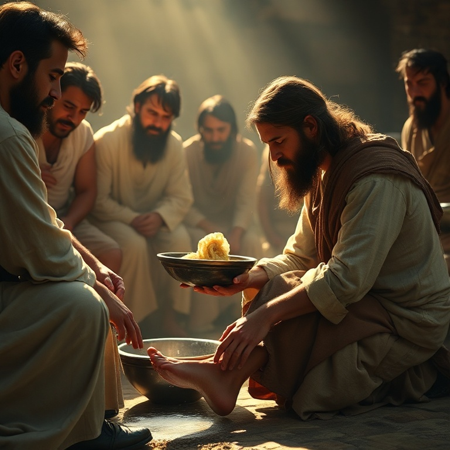
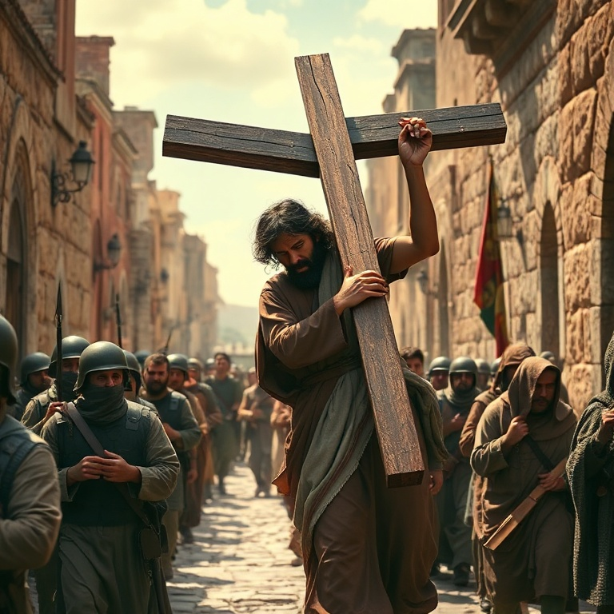
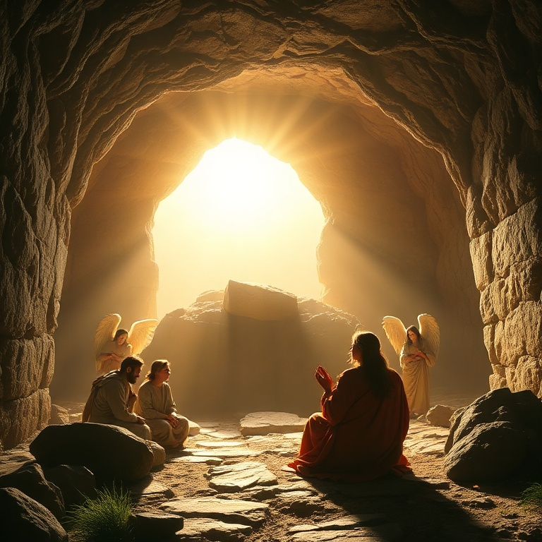

# O Servo Que Veio para Servir: Um Estudo em Marcos

## Índice

1. [Marcos — o Evangelho da Ação](#1-marcos-o-evangelho-da-acao)
2. [Jesus o Servo Sofredor](#2-jesus-o-servo-sofredor)
3. [Milagres e Poder](#3-milagres-e-poder)
4. [O Caminho para a Cruz](#4-o-caminho-para-a-cruz)
5. [A Ressurreição](#5-a-ressurreicao)

---

## Introdução

O Evangelho de Marcos é o mais curto e o mais urgente dos quatro evangelhos. Escrito por João Marcos, companheiro de Pedro e Paulo, este livro tem um ritmo acelerado — a palavra "imediatamente" aparece mais de 40 vezes. Marcos apresenta Jesus não como um rei distante, mas como o Servo Sofredor que veio para servir e dar a sua vida em resgate de muitos. Endereçado a cristãos gentios em Roma, provavelmente durante a perseguição de Nero, Marcos escreve para fortalecer a fé daqueles que sofrem. Nestes cinco capítulos, exploraremos a ação de Jesus, seu sofrimento, seus milagres, o caminho para a cruz e a vitória da ressurreição.

---

## Capítulo 1: Marcos — o Evangelho da Ação

O Evangelho de Marcos começa abruptamente: "Princípio do evangelho de Jesus Cristo, Filho de Deus." Não há genealogia, nem narrativa de nascimento — Marcos vai direto ao ponto. Em apenas 16 capítulos, ele comprime o ministério de Jesus com uma urgência que reflete a necessidade de ação em tempos de crise.

Marcos foi um colaborador de Paulo e Barnabé em suas viagens missionárias, e mais tarde serviu como intérprete de Pedro em Roma. A tradição da igreja primitiva afirma que Marcos escreveu seu evangelho baseado nos sermões de Pedro, o que explica o realismo e os detalhes vívidos que encontramos no texto.

O público de Marcos era primariamente gentio, especialmente cristãos romanos enfrentando perseguição sob o imperador Nero. Isso explica por que Marcos frequentemente explica costumes judaicos e traduz expressões aramaicas. Para estes cristãos perseguidos, o exemplo de Jesus — que serviu até a morte — era um poderoso encorajamento.

Marcos também é conhecido por seu realismo teológico. Ele não hesita em mostrar as fraquezas dos discípulos, a dureza de coração dos líderes religiosos e até mesmo momentos de aparente fragilidade humana de Jesus. Este realismo torna o evangelho autêntico e acessível.

O tema central de Marcos é o "segredo messiânico" — Jesus repetidamente ordena que demônios e pessoas curadas não revelem sua identidade. Marcos quer que seus leitores entendam que Jesus só pode ser verdadeiramente conhecido à luz da cruz.

---

## Capítulo 2: Jesus o Servo Sofredor

Em Marcos, Jesus é apresentado como o Servo Sofredor de Isaías 53. Diferente de um messias político triunfante, Jesus caminha deliberadamente em direção ao sofrimento. O próprio Jesus afirma: "Porque o Filho do Homem também não veio para ser servido, mas para servir e dar a sua vida em resgate de muitos" (Marcos 10:45).

O paradoxo central deste evangelho é que o Filho de Deus age como servo. Jesus lava pés, toca leprosos, acolhe crianças e se associa com pecadores. Sua realeza é expressa não em poder terreno, mas em humildade e serviço sacrificial.

Marcos registra a agonia de Jesus no Getsêmani com uma honestidade comovente. Jesus confessa sua angústia: "A minha alma está profundamente triste até a morte." Ele ora pedindo que o cálice passe, mas se submete à vontade do Pai. Esta cena revela a humanidade plena de Jesus e sua obediência perfeita.

A crucificação em Marcos é descrita com sobriedade. Não há diálogos elaborados como em Lucas ou João. Jesus clama em aramaico: "Eloí, Eloí, lamá sabactâni?" — "Deus meu, Deus meu, por que me desamparaste?" É o grito de alguém que experimenta o abandono, mas que ainda assim clama ao Pai.

O centurião romano, ao ver Jesus expirar, exclama: "Verdadeiramente este homem era o Filho de Deus." A ironia é poderosa: um soldado gentio reconhece o que os líderes judeus não puderam ver. A fé genuína reconhece o Filho de Deus na cruz.

---

## Capítulo 3: Milagres e Poder

Marcos registra mais milagres proporcionalmente do que qualquer outro evangelho. Quase um terço do livro é dedicado a narrativas de milagres. Cada milagre em Marcos tem um propósito teológico: demonstrar o poder de Jesus sobre o pecado, a doença, a natureza e os demônios.

O primeiro milagre em Marcos é a expulsão de um espírito imundo na sinagoga de Cafarnaum (1:21-28). A multidão fica admirada porque Jesus ensina "com autoridade" — sua palavra tem poder para expulsar demônios. Diferente dos exorcistas judeus, Jesus não usa fórmulas ou rituais; ele simplesmente ordena.

As curas em Marcos são frequentemente acompanhadas de toque físico. Jesus toca o leproso (1:41), pega a mão da sogra de Pedro (1:31) e coloca os dedos nos ouvidos do surdo (7:33). Este contato físico era significativo numa cultura onde doenças tornavam a pessoa impura.

Marcos também registra dois milagres sobre a natureza: a tempestade acalmada (4:35-41) e a caminhada sobre as águas (6:45-52). Estes milagres revelam a divindade de Jesus — somente Deus tem poder sobre o vento e o mar.

Um detalhe interessante é que Marcos frequentemente menciona as emoções de Jesus: compaixão (1:41), indignação (3:5), admiração (6:6) e profunda tristeza (14:34). Estes detalhes humanizam Jesus sem diminuir sua divindade, mostrando que ele é tanto poderoso quanto compassivo.

---

## Capítulo 4: O Caminho para a Cruz

A partir de Marcos 8:31, o evangelho toma um rumo decisivo em direção a Jerusalém. Jesus começa a ensinar abertamente sobre sua morte iminente, e o caminho para a cruz torna-se o tema dominante. Pedro, que acabara de confessar Jesus como o Cristo, é repreendido por tentar desviar Jesus deste caminho.

A Transfiguração (9:2-13) ocorre logo após a primeira predição da morte. Jesus é transfigurado diante de Pedro, Tiago e João, revelando sua glória divina. Este evento fortalece os discípulos para o que está por vir — a glória e o sofrimento estão inextricavelmente ligados.

Jesus entra em Jerusalém montado num jumento (11:1-11), cumprindo a profecia de Zacarias, mas de forma humilde. Em vez de um cavalo de guerra, ele escolhe um jumentinho — símbolo de paz. O povo aclama, mas sua expectativa de um messias político será frustrada pela cruz.

No caminho para a cruz, Jesus ensina sobre discipulado: "Se alguém quer vir após mim, negue-se a si mesmo, tome a sua cruz e siga-me" (8:34). O discipulado não é um caminho de glória terrena, mas de entrega sacrificial. Seguir Jesus significa estar disposto a perder a própria vida.

A última ceia (14:12-26) institui a nova aliança no sangue de Cristo. Jesus transforma a refeição pascal em um memorial de seu sacrifício. O pão é seu corpo partido; o vinho é seu sangue derramado. A cruz não é um acidente — é o propósito central de sua missão.

---

## Capítulo 5: A Ressurreição

O Evangelho de Marcos termina com a ressurreição de Jesus, mas de forma surpreendentemente abrupta. As mulheres vão ao túmulo no domingo de manhã para ungir o corpo de Jesus e encontram a pedra removida. Um jovem vestido de branco lhes diz: "Ele ressuscitou; não está aqui" (16:6).

A resposta das mulheres é medo e silêncio. Marcos 16:8 diz: "E, saindo elas, fugiram do sepulcro, porque estavam possuídas de medo e assombro; e não diziam nada a ninguém, porque temiam." Este final abrupto tem sido debatido por estudiosos, mas pode refletir a intenção de Marcos de desafiar seus leitores a proclamar o que as mulheres silenciaram.

A ressurreição em Marcos não é um evento para ser provado, mas uma realidade que transforma. O túmulo vazio não gera fé automática — as mulheres têm medo. A fé no Cristo ressurreto vem por meio do encontro pessoal e do testemunho da comunidade.

A promessa do anjo ecoa: "Ele vai adiante de vós para a Galileia." O discipulado recomeça onde começou. A ressurreição não é o fim da história, mas o início de uma nova etapa. Jesus vai adiante — ele não está preso ao passado, mas lidera o futuro.

Para os cristãos perseguidos a quem Marcos escreve, a ressurreição é a garantia de que o sofrimento presente não tem a última palavra. O mesmo poder que ressuscitou Jesus está disponível para aqueles que o seguem. A cruz não foi o fim — e nenhum sofrimento será o fim para aqueles que estão em Cristo.

---

## Conclusão

O Evangelho de Marcos nos desafia a seguir um Servo que reina por meio da humildade. Em um mundo obcecado por poder e status, Marcos nos lembra que a grandeza no Reino de Deus é medida pelo serviço. Que, como o centurião romano, possamos olhar para a cruz e reconhecer o Filho de Deus. E que, como as mulheres no túmulo vazio, possamos superar o medo e proclamar a verdade da ressurreição.
