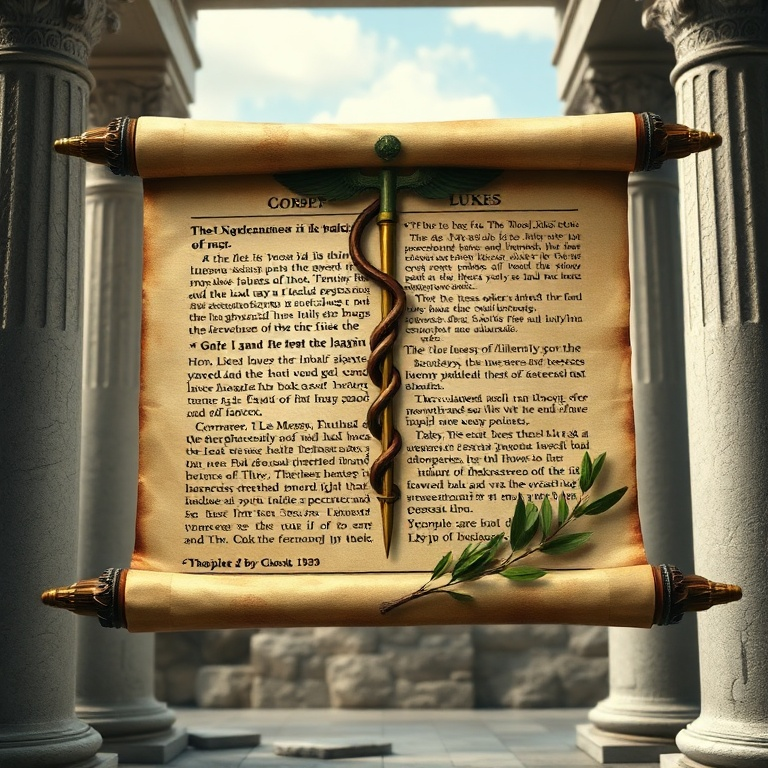
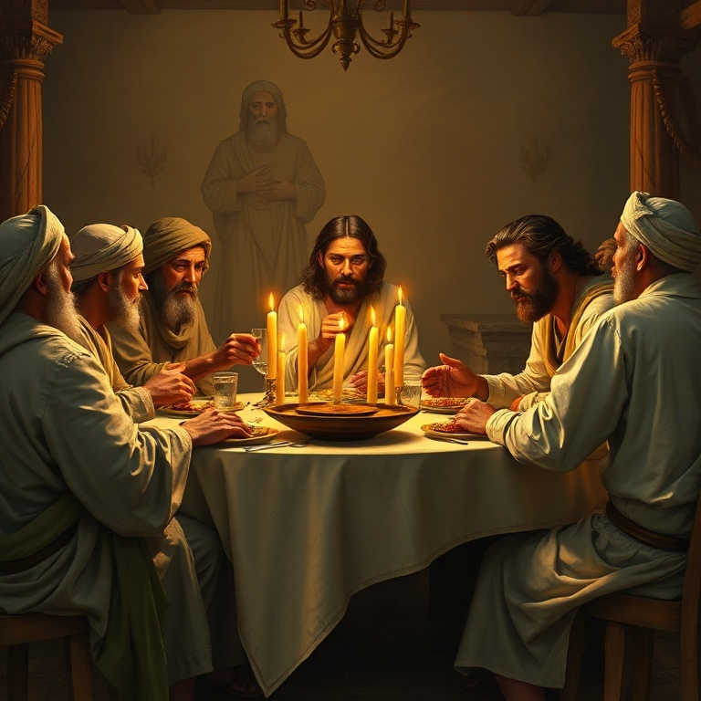

# O Filho do Homem: Um Estudo em Lucas

## Índice

1. [Lucas o Historiador](#1-lucas-o-historiador)
2. [Os Relatos do Nascimento](#2-os-relatos-do-nascimento)
3. [Parábolas da Misericórdia](#3-parabolas-da-misericordia)
4. [Jesus e os Marginalizados](#4-jesus-e-os-marginalizados)
5. [A Viagem a Jerusalém](#5-a-viagem-a-jerusalem)

---

## Introdução

O Evangelho de Lucas é o mais completo e cuidadosamente pesquisado relato da vida de Jesus. Escrito por Lucas, o médico amado que acompanhou Paulo em suas viagens missionárias, este evangelho é o primeiro volume de uma obra em duas partes (com Atos). Lucas dedica seu livro a Teófilo, apresentando "uma exposição em ordem" dos acontecimentos da vida de Jesus. Com ênfase na universalidade da salvação, na compaixão pelos marginalizados e no papel do Espírito Santo, Lucas nos apresenta Jesus como o Filho do Homem que veio buscar e salvar o que se havia perdido. Nestes cinco capítulos, exploraremos suas ênfases únicas.

---

## Capítulo 1: Lucas o Historiador

Lucas é o único escritor do Novo Testamento que não era judeu. Como médico grego, ele traz uma perspectiva gentílica ao evangelho e demonstra um cuidado notável com a precisão histórica. No prólogo de seu evangelho (1:1-4), Lucas explica seu método: investigou cuidadosamente tudo desde o princípio para escrever um relato ordenado.

A precisão de Lucas como historiador é reconhecida até mesmo por estudiosos seculares. Ele menciona governantes específicos (César Augusto, Quirino, Herodes, Pilatos), datas e contextos culturais que podem ser verificados arqueologicamente. Sua atenção aos detalhes reflete seu treinamento científico como médico.

Lucas também demonstra um interesse especial por grupos marginalizados: mulheres, pobres, samaritanos, gentios, publicanos e pecadores. Ele registra histórias que outros evangelistas omitem — como a parábola do Bom Samaritano e do Filho Pródigo — que destacam o amor inclusivo de Deus.

O tema do Espírito Santo é proeminente em Lucas. O Espírito vem sobre Maria, Isabel, Zacarias, Simeão e, mais tarde, sobre Jesus em seu batismo. Lucas mostra que toda a história da salvação é impulsionada pelo poder do Espírito Santo.

Lucas também enfatiza a oração. Ele registra Jesus orando em momentos cruciais: no batismo, antes de escolher os doze, na transfiguração, no Getsêmani. Para Lucas, a oração é o meio pelo qual o discípulo se conecta com a missão de Deus.

---

## Capítulo 2: Os Relatos do Nascimento

Lucas dedica dois capítulos inteiros ao nascimento de Jesus, fornecendo os detalhes mais ricos sobre este evento fundamental. Enquanto Mateus enfoca José e a genealogia, Lucas dá atenção a Maria e aos humildes. Seu relato começa não em Jerusalém, mas numa pequena cidade da Judeia.

O anúncio a Maria (1:26-38) é uma das passagens mais belas da Escritura. Gabriel anuncia que uma virgem conceberá pelo poder do Espírito Santo. A resposta de Maria — "Eis aqui a serva do Senhor" — é o modelo de fé humilde e disponível para o plano de Deus.

O Magnificat (1:46-55) é o cântico de Maria, rico em linguagem do Antigo Testamento. Maria celebra um Deus que derruba os poderosos e exalta os humildes, que enche de bens os famintos e despede vazios os ricos. Este cântico estabelece o tema da inversão dos valores do Reino que percorre todo o evangelho.

O nascimento em Belém (2:1-20) é descrito com simplicidade comovente. Não há palácio nem multidões — apenas uma manjedoura, pastores humildes e anjos que anunciam paz. Lucas enfatiza que o Rei do universo nasce na pobreza e é primeiro reconhecido pelos marginalizados da sociedade.

A apresentação no templo (2:22-40) traz Simeão e Ana, dois idosos fiéis que aguardavam o Consolo de Israel. Simeão profetiza que Jesus será "luz para revelação aos gentios e glória para o teu povo Israel" e alerta Maria que uma espada atravessará sua alma.

---

## Capítulo 3: Parábolas da Misericórdia

Lucas é conhecido como o "evangelho das parábolas" por conter várias histórias exclusivas que destacam a misericórdia de Deus. Estas parábolas não são meramente ilustrações morais, mas janelas para o coração do Pai celestial.

A Parábola do Bom Samaritano (10:25-37) surge de uma pergunta: "Quem é o meu próximo?" Jesus responde com uma história que subverte as expectativas. Um samaritano — desprezado pelos judeus — ajuda um homem deixado à beira da morte enquanto líderes religiosos passam de lado. A verdadeira religião é demonstrada em compaixão prática, não em piedade ritual.

A Parábola do Filho Pródigo (15:11-32) é talvez a mais bela história já contada. Um filho exige sua herança, desperdiça tudo e retorna arrependido. O pai, que o esperava, corre ao seu encontro, abraça-o e celebra. Mas o irmão mais velho se recusa a participar. Jesus revela um Pai que sempre espera, sempre perdoa e sempre celebra o arrependimento.

A Parábola do Fariseu e do Publicano (18:9-14) contrasta a oração orgulhosa do fariseu com a oração humilde do cobrador de impostos. "Ó Deus, tem misericórdia de mim, pecador!" — esta oração, e não a lista de méritos do fariseu, é que alcança o coração de Deus.

A Parábola do Rico Insensato (12:13-21) adverte contra a ganância. O homem que constrói celeiros maiores para guardar sua colheita perde a vida na mesma noite. Lucas constantemente adverte sobre o perigo das riquezas e a necessidade de ser rico para com Deus.

---

## Capítulo 4: Jesus e os Marginalizados

Lucas consistentemente retrata Jesus como alguém que quebra barreiras sociais e religiosas para alcançar os marginalizados. Este tema é tão forte que alguns chamam Lucas de "o evangelho dos excluídos". Jesus em Lucas é amigo de pecadores e banqueteia-se com os rejeitados pela sociedade.

As mulheres recebem destaque especial em Lucas. Desde Isabel e Maria no início, até as mulheres que seguem Jesus e o sustentam financeiramente (8:1-3), passando pela viúva de Naim (7:11-17) e a mulher que unge seus pés (7:36-50). Lucas eleva o status das mulheres numa cultura que as desvalorizava.

Os pobres são uma preocupação constante. Lucas registra as bem-aventuranças em termos materiais: "Bem-aventurados vós, os pobres" (6:20), e acrescenta "Ai de vós, os ricos" (6:24). A pobreza não é idealizada, mas Deus tem um cuidado especial pelos pobres, e a igreja é chamada a refletir este cuidado.

Os samaritanos e gentios aparecem repetidamente. O leproso samaritano que agradece (17:11-19), a parábola do Bom Samaritano e a menção da viúva de Sarepta e Naamã (4:25-27) mostram que a salvação é para todos os povos.

Os publicanos e pecadores são frequentemente encontrados à mesa com Jesus. Zaqueu, o cobrador de impostos, é recebido e transformado. A mulher pega em adultério (João 8, mas no espírito de Lucas) encontra misericórdia. Jesus veio "buscar e salvar o que se havia perdido" (19:10).

---

## Capítulo 5: A Viagem a Jerusalém

Uma das características únicas de Lucas é a "seção de viagem" (9:51-19:44), onde Jesus determina firmemente ir a Jerusalém. Esta seção ocupa quase metade do evangelho e contém muito material exclusivo de Lucas. Jerusalém é o destino inevitável, o lugar onde o Filho do Homem será rejeitado e morto.

Lucas 9:51 é um versículo-chave: "Quando se completaram os dias para a sua assunção, manifestou o firme propósito de ir a Jerusalém." Jesus não é uma vítima das circunstâncias; ele caminha deliberadamente em direção ao seu destino. A viagem a Jerusalém é um ato de obediência e amor.

Durante esta viagem, Jesus ensina sobre o custo do discipulado (9:57-62), envia os setenta discípulos (10:1-24), visita Marta e Maria (10:38-42) e continua ensinando parábolas e realizando milagres. Cada passo em direção a Jerusalém é uma oportunidade de ensino.

A entrada triunfal (19:28-44) é seguida pelo lamento sobre Jerusalém. Jesus chora pela cidade que não reconheceu o tempo da visitação. Lucas é o único evangelista que registra Jesus chorando sobre Jerusalém, revelando seu coração pastoral mesmo diante da rejeição.

No caminho para a cruz, Jesus é crucificado entre dois criminosos. Um deles se arrepende e Jesus lhe promete: "Hoje estarás comigo no Paraíso." Mesmo na cruz, Jesus estende misericórdia ao marginalizado. A morte de Jesus em Lucas é tranquila e confiante: "Pai, nas tuas mãos entrego o meu espírito."

---

## Conclusão

O Evangelho de Lucas nos apresenta um Salvador compassivo que veio para todos — judeus e gentios, ricos e pobres, homens e mulheres, justos e pecadores. Jesus é o Filho do Homem que se identifica com nossa humanidade em todas as suas dimensões. Lucas nos convida a celebrar a misericórdia de Deus, a acolher os marginalizados e a caminhar com Jesus até Jerusalém — e além, até o Pentecostes e a expansão do evangelho.
