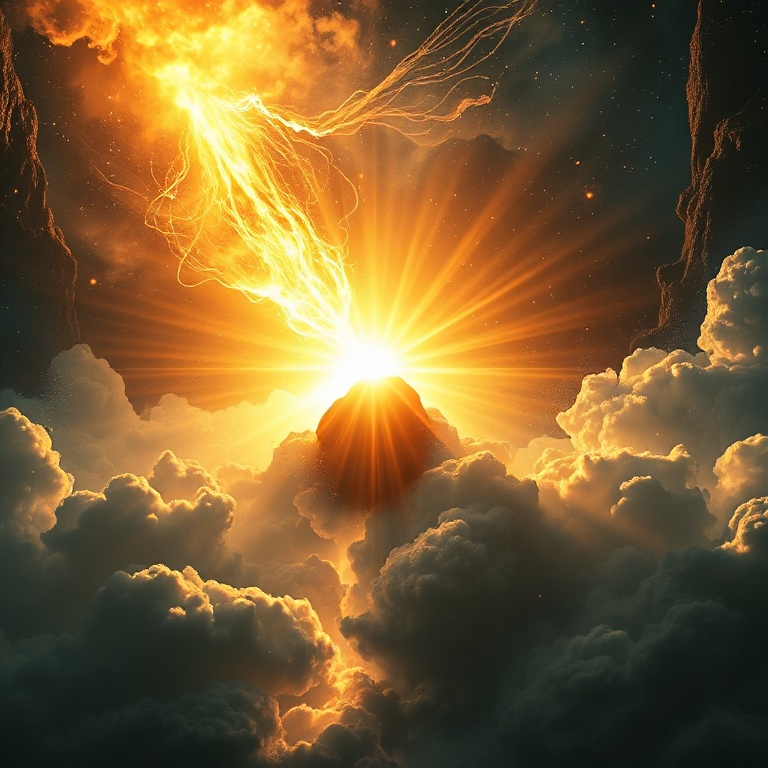
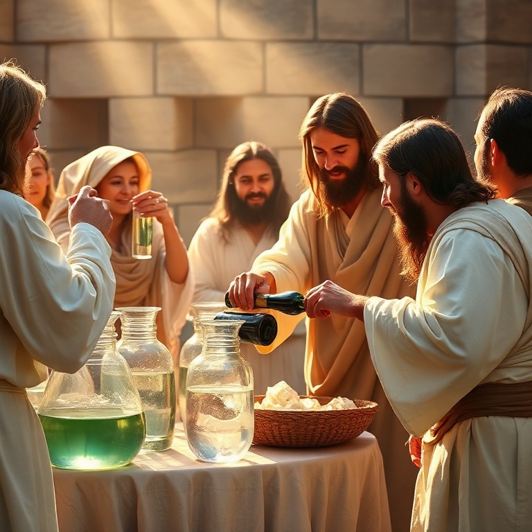
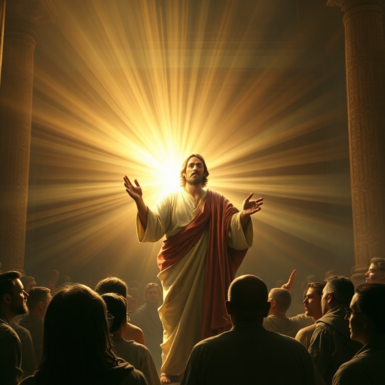
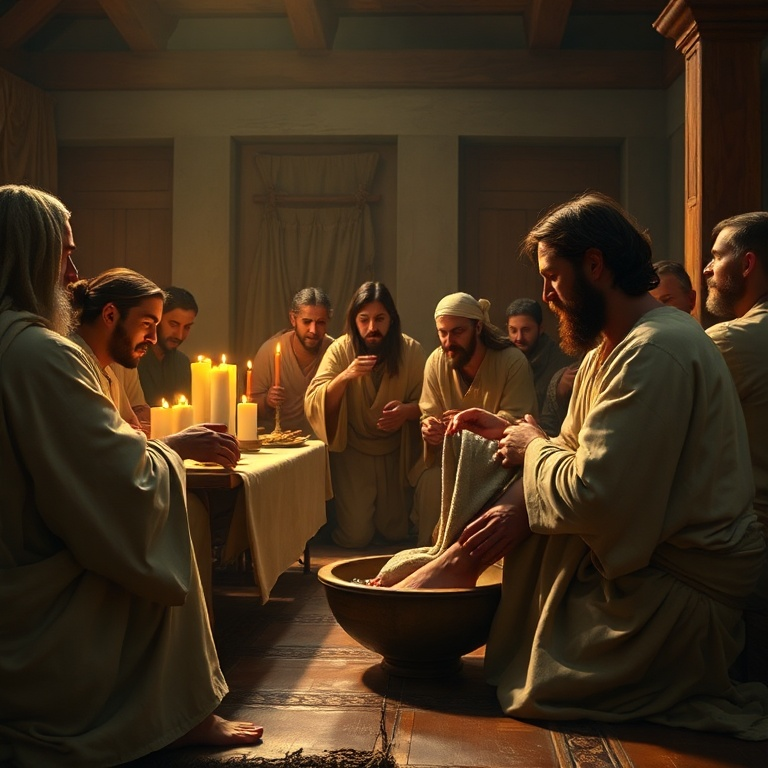
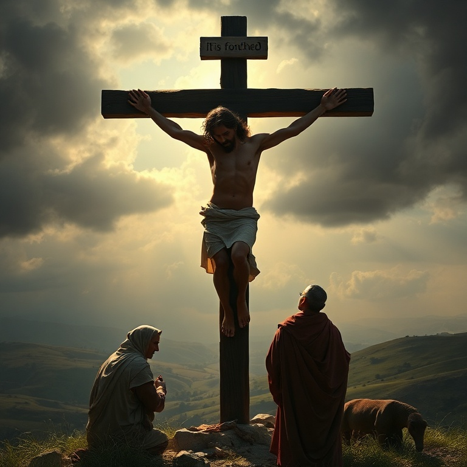

# O Verbo se Fez Carne: Um Estudo em João

## Índice

1. [O Prólogo de João](#1-o-prologo-de-joao)
2. [Os Sinais de Jesus](#2-os-sinais-de-jesus)
3. [Os Discursos do Eu Sou](#3-os-discursos-do-eu-sou)
4. [O Discurso do Cenáculo](#4-o-discurso-do-cenaculo)
5. [A Crucificação e Ressurreição](#5-a-crucificacao-e-ressurreicao)

---

## Introdução

O Evangelho de João é diferente dos outros três — cerca de 90% de seu conteúdo é único. Escrito pelo apóstolo João, o "discípulo amado", este evangelho foi provavelmente o último a ser escrito (entre 85-95 d.C.) e tem um propósito claro: "Estes foram escritos para que creiais que Jesus é o Cristo, o Filho de Deus, e para que, crendo, tenhais vida em seu nome" (20:31). João não apenas narra eventos; ele os interpreta teologicamente, revelando a identidade divina de Jesus por meio de sinais, discursos e declarações "Eu Sou". Este estudo explora o prólogo, os sinais, os discursos, o cenáculo e a paixão-ressurreição.

---

## Capítulo 1: O Prólogo de João

"NO PRINCÍPIO era o Verbo, e o Verbo estava com Deus, e o Verbo era Deus" (1:1). O prólogo de João (1:1-18) é um dos textos mais profundos de toda a Escritura. João ecoa deliberadamente Gênesis 1:1, identificando Jesus como o Verbo preexistente de Deus, por meio de quem todas as coisas foram feitas.

O Verbo (Logos) era um conceito rico tanto para judeus quanto para gregos. Para os judeus, a Palavra de Deus era ativa na criação, na lei e nos profetas. Para os gregos, o Logos era a razão divina que ordenava o universo. João declara que este Logos, que filósofos e teólogos buscavam, se fez carne e habitou entre nós.

O prólogo estabelece vários temas que João desenvolve ao longo do evangelho: vida, luz, testemunho, verdade e glória. "Nele estava a vida, e a vida era a luz dos homens" (1:4). Jesus é a fonte de toda vida e a luz que ilumina toda a humanidade.

João Batista aparece como testemunha, não como protagonista. Ele veio para testificar da luz, não para ser a luz. João Batista aponta para Jesus: "Eis o Cordeiro de Deus, que tira o pecado do mundo" (1:29).

O clímax do prólogo é a encarnação: "E o Verbo se fez carne e habitou entre nós, e vimos a sua glória, como a glória do unigênito do Pai, cheio de graça e de verdade" (1:14). Deus não permaneceu distante — ele entrou em nossa realidade, assumiu nossa humanidade e revelou sua glória de forma acessível.

---

## Capítulo 2: Os Sinais de Jesus

João chama os milagres de Jesus de "sinais" — não meramente obras poderosas, mas indicadores que apontam para a identidade divina de Jesus. João seleciona sete sinais específicos, cada um revelando um aspecto diferente da glória de Cristo.

O primeiro sinal é a transformação da água em vinho em Caná (2:1-11). Este sinal revela a glória de Jesus e aponta para a nova aliança. O vinho novo simboliza a alegria e a abundância do Reino. Os discípulos creem ao verem este sinal.

O segundo sinal é a cura do filho do oficial real (4:46-54). Jesus cura à distância, demonstrando que sua autoridade não está limitada pela presença física. A palavra de Jesus é suficiente.

O terceiro sinal é a cura do paralítico no tanque de Betesda (5:1-18). Jesus cura no sábado, provocando conflito com os líderes religiosos. O sinal revela Jesus como Senhor do sábado e igual a Deus.

O quarto sinal, a multiplicação dos pães (6:1-15), leva ao discurso do Pão da Vida. Jesus satisfaz não apenas a fome física, mas a fome espiritual. Este é o único milagre registrado em todos os quatro evangelhos.

O quinto sinal é Jesus andando sobre as águas (6:16-21), revelando seu domínio sobre a criação. O sexto sinal é a cura do cego de nascença (9:1-41), uma poderosa ilustração de Jesus como a Luz do Mundo. O sétimo e maior sinal é a ressurreição de Lázaro (11:1-44), que prefigura a própria ressurreição de Jesus.

---

## Capítulo 3: Os Discursos do Eu Sou

Em João, Jesus faz sete declarações "Eu Sou" (Ego Eimi), ecoando o nome divino revelado a Moisés em Êxodo 3:14. Cada declaração é acompanhada de uma metáfora que revela um aspecto de sua natureza e obra.

"Eu sou o Pão da Vida" (6:35). Assim como o maná sustentou Israel no deserto, Jesus é o verdadeiro pão que desce do céu. Aqueles que vêm a ele nunca terão fome espiritual.

"Eu sou a Luz do Mundo" (8:12). Em um mundo de trevas e confusão, Jesus é a luz que guia, revela e dá vida. Segui-lo significa andar na luz.

"Eu sou a Porta" (10:9). Jesus é o único acesso à salvação. Não há outro caminho para o aprisco de Deus.

"Eu sou o Bom Pastor" (10:11). Jesus não é um mercenário que foge quando o perigo vem; ele dá a vida pelas ovelhas. O Bom Pastor conhece suas ovelhas e é conhecido por elas.

"Eu sou a Ressurreição e a Vida" (11:25). Diante do túmulo de Lázaro, Jesus declara seu poder sobre a morte. Marta confessa: "Sim, Senhor, eu creio que tu és o Cristo, o Filho de Deus."

"Eu sou o Caminho, a Verdade e a Vida" (14:6). Esta declaração exclusivista afirma que ninguém vem ao Pai senão por Jesus. Ele não é um caminho entre muitos — ele é o único caminho.

"Eu sou a Videira Verdadeira" (15:1). Os discípulos são os ramos que só produzem fruto quando permanecem em Cristo. A vida cristã é uma vida de conexão vital com Jesus.

---

## Capítulo 4: O Discurso do Cenáculo

Os capítulos 13-17 de João são conhecidos como o Discurso do Cenáculo, um dos blocos de ensino mais íntimos e profundos de todo o Novo Testamento. Na noite em que foi traído, Jesus prepara seus discípulos para sua partida iminente.

O capítulo 13 começa com o lava-pés. Jesus, o Mestre e Senhor, assume a posição de servo para lavar os pés dos discípulos. Este ato de humildade radical é um mandamento: "Se eu, Senhor e Mestre, vos lavei os pés, vós deveis também lavar os pés uns dos outros" (13:14).

O capítulo 14 traz as grandes promessas de consolação. Jesus anuncia que vai preparar lugar para eles e que voltará. Ele promete o Espírito Santo, o Consolador (Paráclito), que ensinará, guiará e lembrará os discípulos de tudo o que Jesus disse.

Os capítulos 15-16 desenvolvem o tema da permanência em Cristo. Usando a metáfora da videira e dos ramos, Jesus ensina que a vida frutífera depende da conexão íntima com ele. O mundo odiará os discípulos assim como odiou Jesus, mas o Espírito testificará de Cristo e os capacitará.

O capítulo 17 é a oração sacerdotal de Jesus. Ele ora por si mesmo (para ser glorificado), pelos discípulos (para serem guardados e santificados) e por todos os que crerão por meio da palavra deles (para serem um, assim como o Pai e o Filho são um).

O cenáculo prepara os discípulos não para o triunfo terreno, mas para a missão no poder do Espírito. A unidade, o amor mútuo e a presença do Consolador seriam suas marcas distintivas.

---

## Capítulo 5: A Crucificação e Ressurreição

A narrativa da paixão em João é teologicamente rica e única em vários aspectos. Jesus não é uma vítima passiva — ele está no controle absoluto de todos os acontecimentos. Quando os soldados vêm prendê-lo, Jesus pergunta: "A quem buscais?" Ao responder "Eu Sou", eles caem por terra (18:4-6).

O julgamento de Jesus diante de Pilatos (18:28-19:16) é um diálogo profundo sobre a natureza da verdade. Pilatos pergunta "O que é a verdade?" — ironicamente, a Verdade está diante dele, mas ele não a reconhece. Jesus declara que seu Reino não é deste mundo.

Na cruz, Jesus cuida de sua mãe (19:25-27), confiando Maria ao cuidado do discípulo amado. João registra as palavras "Está consumado" (Tetelestai) — a obra da redenção está completa. Diferente dos outros evangelhos, Jesus não morre clamando em agonia, mas entregando seu espírito voluntariamente.

A ressurreição (20:1-29) é narrada com detalhes comoventes. Maria Madalena encontra o túmulo vazio e corre para avisar os discípulos. Pedro e João correm ao túmulo — João vê e crê.

Jesus aparece a Maria, que inicialmente o confunde com o jardineiro. Quando Jesus a chama pelo nome, ela o reconhece. É um encontro pessoal e transformador. Jesus então aparece aos discípulos, soprando sobre eles o Espírito Santo.

Tomé, que estava ausente, duvida. "Se eu não vir... não crerei." Oito dias depois, Jesus aparece novamente e convida Tomé a tocar suas feridas. Tomé exclama: "Senhor meu e Deus meu!" Jesus responde: "Bem-aventurados os que não viram e creram."

---

## Conclusão

O Evangelho de João nos convida a contemplar o Verbo divino que se fez carne. Dos primeiros versículos do prólogo à última aparição do Cristo ressurreto, João nos mostra quem Jesus realmente é: o Filho de Deus, o Pão da Vida, a Luz do Mundo, a Ressurreição e a Vida. João escreveu para que creiamos — e, crendo, tenhamos vida em seu nome. Que nossa resposta, como a de Tomé, seja: "Senhor meu e Deus meu!"
