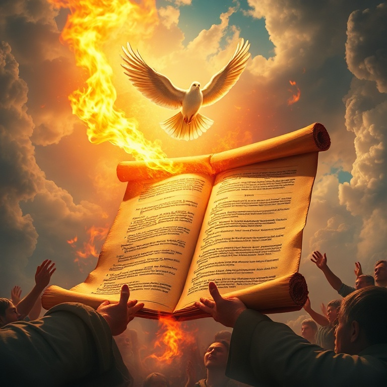
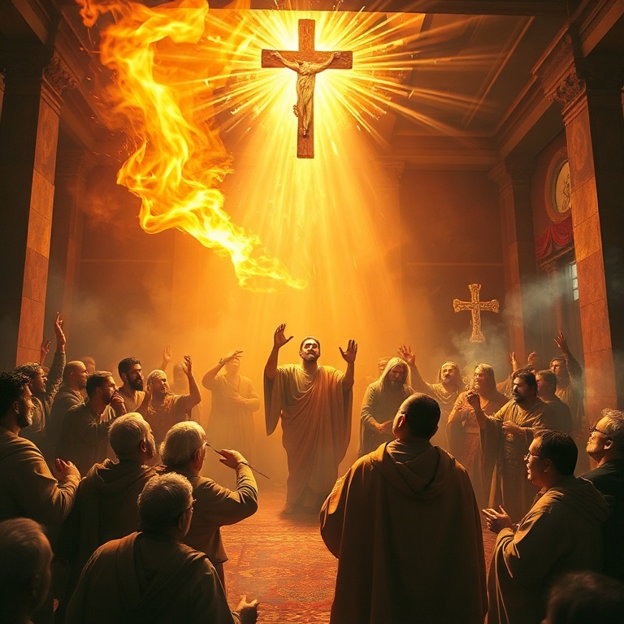
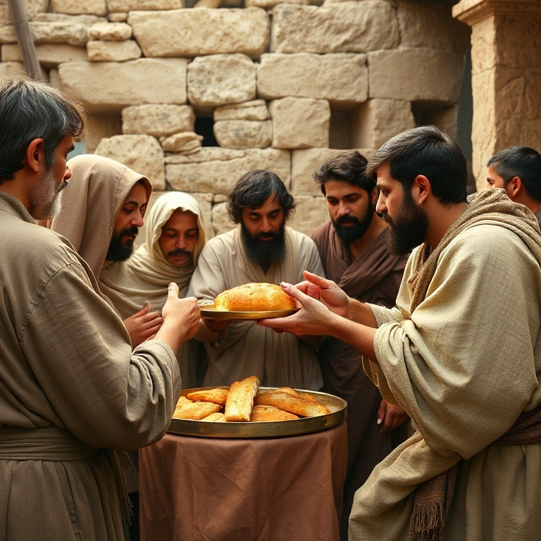
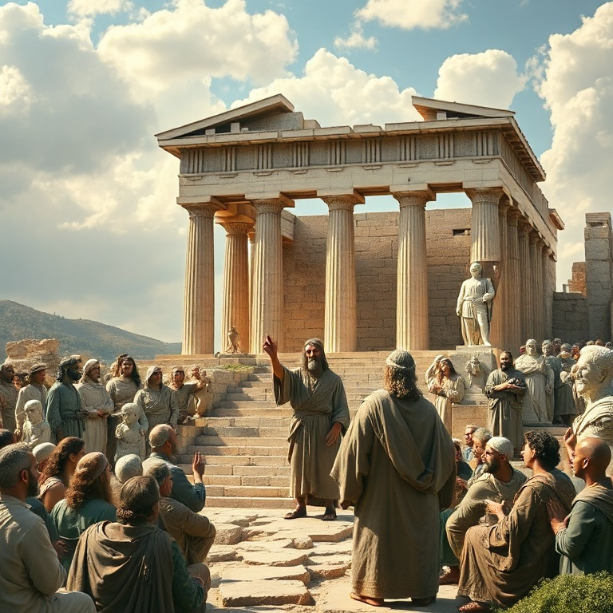

# Poder do Alto: Um Estudo em Atos

## Índice

1. [Pentecostes e o Nascimento da Igreja](#1-pentecostes-e-o-nascimento-da-igreja)
2. [A Igreja em Jerusalém](#2-a-igreja-em-jerusalem)
3. [A Missão se Expande](#3-a-missao-se-expande)
4. [Paulo o Apóstolo dos Gentios](#4-paulo-o-apostolo-dos-gentios)
5. [Até os Confins da Terra](#5-ate-os-confins-da-terra)

---

## Introdução

O livro de Atos dos Apóstolos é a continuação do Evangelho de Lucas, formando uma única obra em dois volumes. Escrito por Lucas, médico e companheiro de Paulo, Atos narra a expansão do cristianismo desde Jerusalém até Roma, cobrindo aproximadamente 30 anos da história da igreja primitiva (30-60 d.C.). O tema central é anunciado por Jesus em Atos 1:8: "Mas recebereis poder ao descer sobre vós o Espírito Santo, e ser-me-eis testemunhas tanto em Jerusalém como em toda a Judeia e Samaria e até os confins da terra." Atos é o registro do cumprimento desta promessa — o poder do Alto capacita a igreja para a missão global.

---

## Capítulo 1: Pentecostes e o Nascimento da Igreja

O livro de Atos começa com uma ponte entre o ministério terreno de Jesus e a era da igreja. Jesus passa quarenta dias aparecendo aos apóstolos e falando sobre o Reino de Deus. Sua instrução final é clara: não devem partir de Jerusalém até receberem "o poder do Alto" — a promessa do Espírito Santo.

A ascensão de Jesus (1:6-11) marca a transição. Enquanto os discípulos olham para o céu, dois anjos os lembram de que Jesus voltará, mas há trabalho a fazer agora. Eles retornam ao cenáculo, onde perseveram em oração com Maria e os irmãos de Jesus. Matias é escolhido para substituir Judas.

O Pentecostes (2:1-13) é o nascimento da igreja. O som como de um vento impetuoso, línguas como de fogo, e o falar em outras línguas — estes sinais revertem a Torre de Babel: onde a humanidade foi dispersa pela confusão de línguas, agora o Espírito unifica pessoas de todas as nações na mensagem do evangelho.

O sermão de Pedro (2:14-41) é o primeiro grande sermão cristão. Ele cita Joel 2 para explicar o derramamento do Espírito e proclama Jesus como Senhor e Cristo. O resultado: cerca de três mil almas são acrescentadas. A igreja nasce com um crescimento explosivo.

A comunidade primitiva (2:42-47) é descrita como devota ao ensino dos apóstolos, à comunhão, ao partir do pão e às orações. Eles compartilham seus bens, louvam a Deus e têm a simpatia de todo o povo. O Senhor acrescenta diariamente os que são salvos.

---

## Capítulo 2: A Igreja em Jerusalém

A igreja em Jerusalém cresce rapidamente, mas também enfrenta seus primeiros desafios. Os capítulos 3-7 de Atos registram tanto o avanço do evangelho quanto a crescente oposição das autoridades religiosas.

A cura do coxo na porta Formosa (3:1-10) é o primeiro milagre pós-Pentecostes. Pedro e João não têm prata nem ouro, mas dão o que têm — o nome de Jesus. O homem entra no templo saltando e louvando a Deus, atraindo uma multidão.

Pedro prega novamente (3:11-26), chamando Israel ao arrependimento. Os líderes religiosos ficam perturbados e prendem Pedro e João. Diante do Sinédrio, Pedro declara corajosamente: "Não há salvação em nenhum outro" (4:12).

A oração da igreja diante da perseguição (4:23-31) é um modelo de fé. Eles não pedem proteção, mas ousadia para continuar pregando. O lugar treme, e eles são cheios do Espírito Santo.

Ananias e Safira (5:1-11) representam o primeiro pecado grave na igreja. A mentira ao Espírito Santo resulta em morte súbita. Este episódio demonstra a seriedade da hipocrisia e a santidade de Deus na comunidade.

A nomeação dos sete diáconos (6:1-7) resolve uma crise administrativa e libera os apóstolos para a oração e o ministério da palavra. Estêvão, um dos sete, é descrito como cheio de fé e do Espírito Santo. Seu testemunho culmina no martírio (7:54-60), espalhando a igreja para além de Jerusalém.

---

## Capítulo 3: A Missão se Expande

A perseguição que se segue ao martírio de Estêvão serve como catalisador para a expansão da igreja. Atos 8-12 registra a propagação do evangelho para a Judeia, Samaria e além, alcançando novos grupos étnicos e culturais.

Filipe evangeliza Samaria (8:4-25), onde multidões creem e são batizadas. Pedro e João vêm confirmar o trabalho, e os samaritanos recebem o Espírito Santo. A barreira entre judeus e samaritanos começa a ser derrubada.

O encontro de Filipe com o eunuco etíope (8:26-40) é um marco na missão. Um oficial estrangeiro, provavelmente um prosélito, lê Isaías sem entender. Filipe explica as Escrituras e o batiza. O eunuco segue seu caminho alegre — o evangelho alcança a África.

A conversão de Saulo (9:1-19) é um dos eventos mais transformadores da história da igreja. O perseguidor dos cristãos encontra o Cristo ressurreto no caminho de Damasco. Cego por três dias, ele é curado por Ananias, batizado e começa imediatamente a pregar.

Pedro e Cornélio (10:1-48) representam a abertura definitiva do evangelho aos gentios. Deus dá a Pedro uma visão que abole as distinções cerimoniais entre puro e impuro. Cornélio, um centurião romano temente a Deus, recebe o Espírito Santo antes mesmo de ser batizado.

A igreja em Antioquia (11:19-30) torna-se o novo centro missionário. Lá os discípulos foram primeiramente chamados "cristãos". Barnabé e Paulo ensinam ali, e a igreja se torna a base para as viagens missionárias.

---

## Capítulo 4: Paulo o Apóstolo dos Gentios

A partir de Atos 13, o foco muda para Paulo e suas viagens missionárias. Paulo, anteriormente Saulo, o perseguidor, torna-se o maior missionário da igreja primitiva, levando o evangelho por todo o mundo mediterrâneo.

A primeira viagem missionária (13-14) leva Paulo e Barnabé a Chipre e ao sul da Ásia Menor. Pregam primeiro nas sinagogas judaicas, mas, diante da rejeição, voltam-se para os gentios. Em Listra, Paulo é apedrejado e dado por morto, mas levanta e continua.

O Concílio de Jerusalém (15:1-35) resolve a controvérsia sobre a circuncisão. A decisão é clara: os gentios não precisam se tornar judeus para serem salvos. A salvação é pela graça, mediante a fé. Paulo e Barnabé se separam, e Paulo escolhe Silas como novo companheiro.

A segunda viagem missionária (15:36-18:22) leva Paulo através da Ásia Menor até a Grécia. Em Filipos, uma visão do "homem macedônio" dirige Paulo à Europa. Lídia, a vendedora de púrpura, crê e sua casa é batizada. Paulo e Silas são presos, mas um terremoto abre as portas da prisão.

Em Atenas (17:16-34), Paulo prega no Areópago, usando a cultura grega como ponte para o evangelho. Em Corinto, Paulo passa dezoito meses estabelecendo uma igreja. A terceira viagem (18:23-21:16) concentra-se em Éfeso, onde o evangelho se espalha por toda a Ásia.

---

## Capítulo 5: Até os Confins da Terra

Os capítulos finais de Atos (21-28) registram a jornada de Paulo a Jerusalém e, finalmente, a Roma. Apesar das correntes e da prisão, Paulo continua testemunhando. O livro termina com Paulo em Roma, pregando "com toda a liberdade, sem impedimento algum".

Paulo retorna a Jerusalém (21:17-26) apesar das profecias de sofrimento. Ele é preso no templo após tumulto instigado por judeus da Ásia. Preso por dois anos em Cesareia, Paulo faz sua defesa perante Félix, Festo e Agripa.

O discurso de Paulo perante Agripa (26:1-32) é um dos momentos mais dramáticos de Atos. Paulo conta sua história de conversão e pergunta: "Crês, rei Agripa, nos profetas? Eu sei que crês." Agripa responde: "Por pouco me persuades a fazer-me cristão."

Paulo apela para César (25:10-12), iniciando sua viagem a Roma. A viagem marítima (27:1-44) inclui uma tempestade devastadora e um naufrágio em Malta. Paulo permanece calmo, encorajando todos com a promessa de que ninguém pereceria.

Em Malta (28:1-10), Paulo cura o pai de Públio e muitos outros doentes. Finalmente chega a Roma (28:11-31), onde é recebido por irmãos. Preso em sua própria casa, Paulo recebe todos que vêm visitá-lo, pregando o Reino de Deus e ensinando sobre o Senhor Jesus Cristo.

O final abrupto de Atos sugere que a história continua. A missão não terminou com Paulo em Roma — continua com cada geração de crentes até que Cristo volte.

---

## Conclusão

O livro de Atos nos lembra que a igreja não é uma instituição estática, mas um movimento vivo impulsionado pelo Espírito Santo. Do Pentecostes em Jerusalém à pregação de Paulo em Roma, vemos o evangelho transcender barreiras culturais, étnicas e geográficas. A mesma promessa de "poder do Alto" é para nós hoje. Somos chamados a continuar a história — testemunhando em nossas Jerusaléns, Judeias, Samarias e até os confins da terra.
