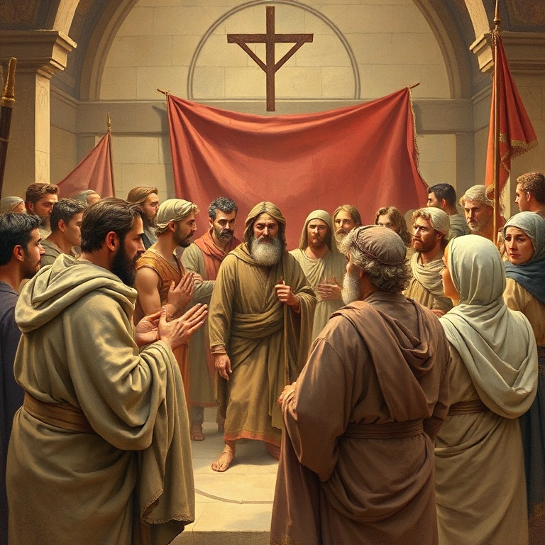

# Corpo de Cristo em Unidade

## Índice

1. [Divisões na Igreja](#1-divisões-na-igreja)
2. [Sabedoria versus Loucura](#2-sabedoria-versus-loucura)
3. [Dons Espirituais](#3-dons-espirituais)
4. [O Amor que Supera Tudo](#4-o-amor-que-supera-tudo)
5. [A Ressurreição dos Santos](#5-a-ressurreição-dos-santos)

---

## Introdução

A primeira carta aos Coríntios é uma das epístolas mais práticas de Paulo, escrita por volta de 54-55 d.C. para lidar com problemas graves na igreja em Corinto: divisões, imoralidade, disputas judiciais, abusos na ceia do Senhor e confusão sobre dons espirituais. Paulo não apenas corrige, mas apresenta a visão sublime da igreja como corpo de Cristo, onde o amor é o caminho mais excelente e a ressurreição é a esperança viva de todo crente.

---

## Capítulo 1: Divisões na Igreja

A igreja em Corinto estava fragmentada. Grupos declaravam lealdade a diferentes líderes: "Eu sou de Paulo", "Eu sou de Apolo", "Eu sou de Cefas", "Eu sou de Cristo". Paulo confronta esta mentalidade partidária com veemência. Cristo não está dividido! Paulo não foi crucificado por ninguém, nem ninguém foi batizado em nome de Paulo. A lealdade suprema pertence exclusivamente a Cristo.

Estas divisões revelavam imaturidade espiritual. Os coríntios estavam andando segundo a carne, não segundo o Espírito. Agiam como meros homens, cedendo à sabedoria mundana que valoriza personalidades e eloquência humana. Paulo os lembra que a mensagem da cruz é loucura para os que se perdem, mas poder de Deus para os que se salvam.

A solução para as divisões é retornar ao centro: Jesus Cristo crucificado. O evangelho nivela todo orgulho humano — não há espaço para facções quando a cruz é o foco. A igreja não é uma arena de competição entre líderes, mas uma família unida pelo sangue de Cristo.

Paulo também aborda a questão da sabedoria humana versus a sabedoria de Deus. Deus escolheu as coisas loucas do mundo para envergonhar os sábios, e as coisas fracas para envergonhar os fortes. Ninguém pode se gloriar diante de Deus — a glória pertence somente ao Senhor.

---

## Capítulo 2: Sabedoria versus Loucura

A sabedoria deste mundo contrasta radicalmente com a sabedoria de Deus. Os coríntios, influenciados pela cultura grega que valorizava a retórica e a filosofia, estavam menosprezando a simplicidade do evangelho. Paulo deliberadamente evitou eloquência e sabedoria humana ao pregar em Corinto, decidindo nada saber entre eles senão Jesus Cristo e este crucificado.

A sabedoria divina é revelada pelo Espírito Santo, que perscruta as profundezas de Deus. O homem natural não aceita as coisas do Espírito de Deus, pois lhe são loucura. Mas o crente espiritual discerne todas as coisas. A verdadeira sabedoria não é adquirida por intelecto humano, mas por revelação divina por meio do Espírito que habita em nós.

Paulo utiliza a metáfora da construção para ilustrar o ministério. Ele plantou, Apolo regou, mas Deus deu o crescimento. Cada obreiro é responsável pelo seu trabalho, mas o fundamento é único: Jesus Cristo. Se alguém constrói sobre este fundamento com ouro, prata ou madeira, o fogo do juízo revelará a qualidade da obra.

O capítulo 4 conclui com uma advertência solene contra o orgulho. Paulo e os apóstolos são servos de Cristo e despenseiros dos mistérios de Deus. Eles são espetáculo ao mundo, considerados tolos por amor de Cristo. O reino de Deus não consiste em palavra, mas em poder. Que ninguém se engane com vãs filosofias humanas.

---

## Capítulo 3: Dons Espirituais

Os capítulos 12-14 formam o tratado paulino sobre os dons espirituais. Paulo começa estabelecendo o princípio fundamental: ninguém pode dizer "Jesus é Senhor" senão pelo Espírito Santo. A diversidade de dons procede do mesmo Espírito, do mesmo Senhor e do mesmo Deus. Cada crente recebe a manifestação do Espírito para o bem comum.

A lista de dons inclui palavra de sabedoria, palavra de conhecimento, fé, dons de cura, operação de milagres, profecia, discernimento de espíritos, variedade de línguas e interpretação de línguas. Paulo enfatiza que todos os dons são importantes e necessários, e que o Espírito distribui a cada um individualmente conforme sua vontade soberana.

A metáfora do corpo é central. Assim como o corpo tem muitos membros com funções diferentes, a igreja é um só corpo com muitos membros. O olho não pode dizer à mão: "Não tenho necessidade de ti." Deus dispôs os membros no corpo como lhe aprouve, dando maior honra aos membros menos honrosos, para que não haja divisão.

Paulo dedica o capítulo 14 ao dom de profecia e línguas, estabelecendo ordem no culto. A profecia edifica a igreja, enquanto as línguas edificam o indivíduo. No culto público, o amor determina que tudo seja feito para edificação mútua. Deus não é Deus de confusão, mas de paz. Tudo deve ser feito decentemente e com ordem.

---

## Capítulo 4: O Amor que Supera Tudo

O capítulo 13 de 1 Coríntios é o "hino ao amor" mais belo de toda a Escritura. Paulo coloca o amor como o caminho mais excelente, superior a todos os dons espirituais. Sem amor, o dom de línguas é ruído vazio, a profecia é inútil, a fé que remove montanhas é nada, e o auto-sacrifício sem amor não aproveita.

O amor é descrito em termos práticos e relacionais. Ele é paciente e benigno. Não é invejoso, não se vangloria, não se orgulha. Não se comporta indecentemente, não busca seus próprios interesses, não se irrita facilmente, não guarda rancor. O amor não se alegra com a injustiça, mas regozija-se com a verdade. Tudo sofre, tudo crê, tudo espera, tudo suporta.

As profecias, as línguas e o conhecimento são temporários — quando vier o perfeito, o imperfeito passará. Mas o amor jamais acaba. A fé, a esperança e o amor permanecem, mas o maior destes é o amor. Esta é a essência da vida cristã: o amor que procede de Deus e reflete o caráter de Cristo.

Este capítulo é o ponto culminante da carta. Antes de abordar dons e ordem no culto, Paulo estabelece que o amor é o alicerce de tudo. A igreja de Corinto, tão talentosa e cheia de dons, precisava desta palavra: o dom maior não é o mais espetacular, mas o amor que edifica e une o corpo de Cristo.

---

## Capítulo 5: A Ressurreição dos Santos

O capítulo 15 é o grande tratado paulino sobre a ressurreição. Alguns em Corinto negavam a ressurreição dos mortos. Paulo responde com argumentos irrefutáveis: Cristo ressuscitou ao terceiro dia, apareceu a Pedro, aos doze, a mais de quinhentos irmãos de uma vez, a Tiago, a todos os apóstolos, e por último a Paulo mesmo.

Se Cristo não ressuscitou, a pregação é vã e a fé é inútil. Os apóstolos seriam falsas testemunhas, e os crentes ainda estariam em seus pecados. Mas Cristo ressuscitou! Ele é as primícias dos que dormem. Como em Adão todos morrem, em Cristo todos serão vivificados. Cada um em sua ordem: Cristo, as primícias; depois os que são de Cristo na sua vinda.

Paulo descreve o corpo da ressurreição como incorruptível, glorioso, poderoso e espiritual. Semeia-se em corrupção, ressuscita em incorrupção. Semeia-se em fraqueza, ressuscita em poder. Semeia-se corpo natural, ressuscita corpo espiritual. A vitória final é sobre a morte: "Tragada foi a morte pela vitória."

O capítulo termina com um hino triunfante de gratidão e exortação. "Graças a Deus, que nos dá a vitória por nosso Senhor Jesus Cristo." A certeza da ressurreição transforma o presente: "Portanto, meus amados irmãos, sede firmes e constantes, sempre abundantes na obra do Senhor, sabendo que vosso trabalho não é vão no Senhor."

---

## Conclusão

Primeira Coríntios nos ensina que a igreja é o corpo de Cristo, unida na diversidade, edificada pelo amor e fundamentada na ressurreição. Paulo confronta divisões, reorienta a busca por dons e eleva o amor como o caminho supremo. A esperança da ressurreição dá sentido ao sofrimento presente e motiva o serviço fiel. Que sejamos uma igreja enraizada no amor e firmada na esperança da vida eterna.
