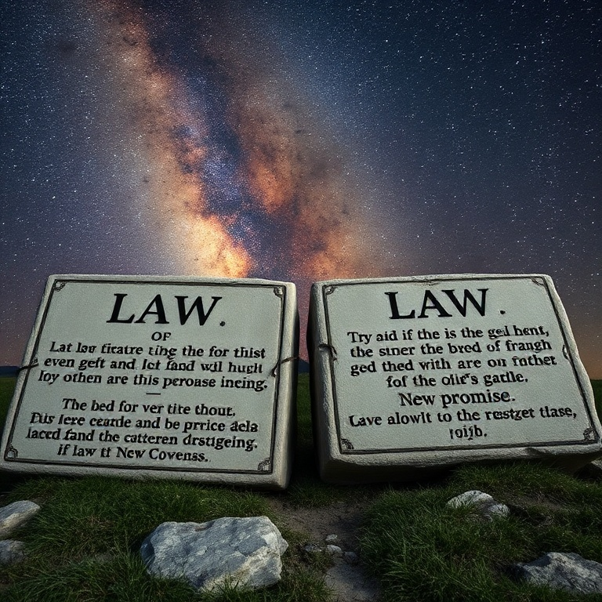

# Liberdade em Cristo

## Índice

1. [Outro Evangelho?](#1-outro-evangelho)
2. [Justificação pela Fé em Cristo](#2-justificação-pela-fé-em-cristo)
3. [A Lei e a Promessa](#3-a-lei-e-a-promessa)
4. [Filhos e Herdeiros](#4-filhos-e-herdeiros)
5. [Andar no Espírito](#5-andar-no-espírito)

---

## Introdução

Gálatas é a carta da liberdade cristã. Escrita por volta de 48-49 d.C., é provavelmente a primeira epístola de Paulo. Com tom urgente e apaixonado, Paulo confronta a igreja da Galácia que estava sendo seduzida por judaizantes — falsos mestres que ensinavam que a circuncisão e a observância da lei eram necessárias para a salvação. Paulo defende com veemência que a justificação é somente pela fé em Cristo, e que a verdadeira liberdade é viver no Espírito, não debaixo da escravidão da lei.

---

## Capítulo 1: Outro Evangelho?

Paulo abre Gálatas com uma nota surpreendente: não há elogios, apenas espanto e indignação pastoral. Os gálatas estavam se afastando tão rapidamente daquele que os chamou pela graça de Cristo para um "outro evangelho". Paulo é categórico: não há outro evangelho. Se alguém — mesmo um anjo do céu — pregar um evangelho diferente, seja anátema.

O apóstolo defende sua autoridade apostólica. Seu evangelho não é de origem humana, nem o recebeu de homem algum, mas por revelação direta de Jesus Cristo. Antes de ser apóstolo, Paulo era perseguidor da igreja, mas Deus o separou desde o ventre materno e o chamou por sua graça para pregar Cristo entre os gentios.

Paulo relata seu encontro com os apóstolos em Jerusalém. Tiago, Pedro e João reconheceram que a graça lhe fora dada para evangelizar os incircuncisos, assim como Pedro para os circuncisos. Lhe deram a destra da comunhão, confirmando que seu evangelho era autêntico.

O centro do debate é claro: ou a salvação é pela graça mediante a fé, ou é pelas obras da lei. Não há meio-termo. Paulo não cede nem por um momento à pressão dos judaizantes, pois a verdade do evangelho estava em jogo. A liberdade cristã não pode ser comprometida.

---

## Capítulo 2: Justificação pela Fé em Cristo

Paulo narra seu confronto com Pedro em Antioquia. Pedro se afastava dos gentios quando os judaizantes chegavam, por medo dos circuncisos. Paulo o resistiu na cara porque sua hipocrisia comprometia a verdade do evangelho. Se Pedro, sendo judeu, vivia como gentio, por que obrigar os gentios a viver como judeus?

A declaração central da carta está em Gálatas 2.16: "Sabendo que o homem não é justificado pelas obras da lei, mas pela fé em Jesus Cristo, também cremos em Cristo Jesus para sermos justificados pela fé em Cristo, e não pelas obras da lei; porque pelas obras da lei nenhuma carne será justificada."

Paulo explica que, por meio da lei, morremos para a lei para viver para Deus. Estou crucificado com Cristo; já não sou eu quem vive, mas Cristo vive em mim. A vida que agora vivo na carne, vivo pela fé no Filho de Deus, que me amou e se entregou por mim. Esta é a experiência pessoal e transformadora da justificação.

Se a justiça viesse pela lei, Cristo teria morrido em vão. Paulo não anula a graça de Deus. A justificação pela fé não é uma doutrina abstrata — é a realidade que liberta o crente da escravidão do legalismo e o coloca em comunhão viva com Cristo.

---

## Capítulo 3: A Lei e a Promessa

Paulo faz uma pergunta retórica aos gálatas: "Recebestes o Espírito pelas obras da lei ou pela pregação da fé?" Eles haviam começado no Espírito; por que agora querem se aperfeiçoar pela carne? Abraão creu em Deus, e isso lhe foi imputado como justiça. Os que são da fé são filhos de Abraão.

A lei veio depois da promessa e não a invalida. A promessa foi feita a Abraão e à sua descendência, que é Cristo. A lei foi acrescentada por causa das transgressões, até que viesse a descendência a quem a promessa fora feita. A lei não se opõe às promessas de Deus — se a lei pudesse dar vida, a justiça seria pela lei.

Paulo descreve a lei como um aio ou tutor que nos conduzia a Cristo, para que fôssemos justificados pela fé. Com a vinda da fé, já não estamos sob aio. Todos são filhos de Deus pela fé em Cristo Jesus. Batizados em Cristo, nos revestimos de Cristo — não há judeu nem grego, escravo nem livre, macho nem fêmea, pois todos são um em Cristo Jesus.

A herança não vem pela observância da lei, mas pela promessa recebida mediante a fé. A lei revela o pecado, mas não pode salvar. A promessa revela a graça e salva todos os que creem. Esta é a chave hermenêutica para entender o Antigo Testamento: a lei aponta para Cristo.

---

## Capítulo 4: Filhos e Herdeiros

Paulo usa a alegoria de Abraão, Sara e Agar para ilustrar a diferença entre a escravidão da lei e a liberdade da promessa. Agar representa o monte Sinai, a aliança da lei que gera escravidão. Sara representa a Jerusalém celestial, a aliança da promessa que gera liberdade. "Lançai fora a escrava e seu filho, pois o filho da escrava não será herdeiro com o filho da livre."

O apóstolo expressa profunda angústia pastoral. Ele sofre dores de parto até que Cristo seja formado nos gálatas. Eles eram amados e haviam recebido bem a Paulo em sua primeira visita, mas agora estavam sendo seduzidos por aqueles que querem agradá-los na carne. O zelo sem conhecimento é perigoso.

Os crentes não são mais escravos, mas filhos. E porque são filhos, Deus enviou o Espírito de seu Filho aos seus corações, clamando: "Aba, Pai." Já não sois escravo, mas filho; e, se filho, também herdeiro por Deus. Esta é a identidade do crente em Cristo — filho amado e herdeiro das promessas.

Voltar à lei é voltar à escravidão. Os gálatas observavam dias, meses, tempos e anos — Paulo teme ter trabalhado em vão entre eles. A liberdade em Cristo não é permissão para pecar, mas libertação do sistema de obras humanas para viver na graça abundante de Deus.

---

## Capítulo 5: Andar no Espírito

Paulo conclama os gálatas a permanecerem firmes na liberdade com que Cristo os libertou, não se submetendo novamente ao jugo da escravidão. A fé que opera pelo amor é o que importa. Em Cristo Jesus, nem a circuncisão nem a incircuncisão têm valor, mas a fé que age pelo amor.

Andar no Espírito é a alternativa tanto ao legalismo quanto à libertinagem. As obras da carne são manifestas: prostituição, impureza, idolatria, feitiçaria, inimizades, porfias, ciúmes, iras, discórdias, heresias, invejas, homicídios, bebedices. Os que praticam tais coisas não herdarão o reino de Deus.

O fruto do Espírito, porém, é: amor, alegria, paz, longanimidade, benignidade, bondade, fidelidade, mansidão, domínio próprio. Contra estas coisas não há lei. O fruto não é produzido por esforço humano, mas pela obra do Espírito na vida do crente que vive em comunhão com Deus.

Paulo conclui com exortações práticas: uns aos outros levem os fardos, e assim cumpram a lei de Cristo. Não nos cansemos de fazer o bem. A circuncisão não é nada — o que importa é a nova criação. Paz e misericórdia sobre os que andam segundo esta regra. A marca de Paulo em seu corpo são as cicatrizes do serviço a Cristo. A graça de Jesus Cristo seja com o espírito dos irmãos.

---

## Conclusão

Gálatas é o grito de liberdade que ecoa através dos séculos. Paulo defende inabalavelmente que a salvação é pela graça mediante a fé, não por obras humanas. A lei nos conduziu a Cristo, e nele somos filhos e herdeiros. Libertados da escravidão do legalismo, somos chamados a andar no Espírito, produzindo o fruto que agrada a Deus. Permaneçamos firmes na liberdade que Cristo nos conquistou.
