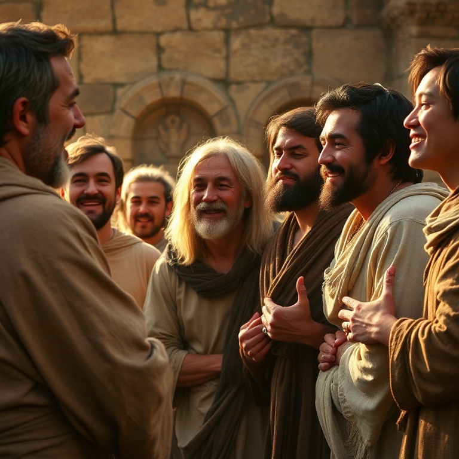

# Esperança Viva — Estudo Bíblico de 1 Tessalonicenses

## Índice

1. [Modelo de Fé](#1-modelo-de-fé)
2. [Pureza e Santidade](#2-pureza-e-santidade)
3. [Amor Fraternal](#3-amor-fraternal)
4. [A Volta do Senhor](#4-a-volta-do-senhor)
5. [Vigilância e Santificação](#5-vigilância-e-santificação)

---

## Introdução

A primeira carta de Paulo aos Tessalonicenses é considerada um dos primeiros escritos do Novo Testamento, datada de aproximadamente 50-51 d.C. Paulo escreveu de Corinto, após receber notícias encorajadoras de Timóteo sobre a jovem igreja que havia sido fundada em Tessalônica durante sua segunda viagem missionária. Apesar de intensa perseguição, os tessalonicenses permaneciam firmes na fé e eram um exemplo para todas as igrejas da Macedônia e Acaia. Paulo escreve para encorajá-los, instruí-los em questões de santidade e esclarecer dúvidas sobre a volta de Cristo.

A carta é marcada por um tom pastoral, afetuoso e cheio de gratidão. A expectativa da parusia (a volta de Cristo) permeia toda a epístola, oferecendo esperança viva em meio às tribulações. Mais do que uma carta doutrinária, 1 Tessalonicenses é uma carta pastoral que respira o coração de um pai espiritual por seus filhos na fé. Tessalônica era uma cidade portuária estratégica na Via Egnácia, a principal rota comercial entre Roma e o Oriente. Sua população era culturalmente diversa, incluindo romanos, gregos e judeus. A igreja ali foi fundada por Paulo em meio a grande controvérsia (At 17.1-9), e os crentes enfrentavam hostilidade tanto dos judeus quanto dos gentios. Este contexto de perseguição torna o testemunho dos tessalonicenses ainda mais notável.

A estrutura da carta segue o padrão das epístolas paulinas: saudação, ação de graças, corpo doutrinário, exortações práticas e conclusão. No entanto, 1 Tessalonicenses se distingue pela ausência de uma seção doutrinária extensa — Paulo não precisa corrigir erros teológicos graves, apenas esclarecer mal-entendidos sobre a volta de Cristo. A carta é essencialmente pastoral e consoladora. A tríade "fé, amor e esperança" (1Ts 1.3) funciona como o tema unificador: a fé que age, o amor que serve e a esperança que persevera. Esta tríade aparece novamente em 1Ts 5.8 como a armadura do crente, e ecoa em outras cartas paulinas como a síntese da vida cristã autêntica.

---

## Capítulo 1: Modelo de Fé

Paulo, juntamente com Silvano e Timóteo, dirige-se à igreja dos tessalonicenses em Deus Pai e no Senhor Jesus Cristo. Ele começa com uma ação de graças constante, lembrando-se da obra de fé, do trabalho de amor e da perseverança da esperança dos crentes. A eleição deles era evidente porque o evangelho não lhes chegou apenas em palavras, mas em poder, no Espírito Santo e com plena convicção. Os tessalonicenses tornaram-se imitadores de Paulo e do Senhor, recebendo a palavra em meio a muita tribulação, com alegria do Espírito Santo. Eles se tornaram modelo para todos os crentes na Macedônia e na Acaia.

A fama de sua fé se espalhou: eles se converteram dos ídolos a Deus para servir ao Deus vivo e verdadeiro e aguardar dos céus o seu Filho, a quem ressuscitou dos mortos, Jesus, que nos livra da ira vindoura. A vida transformada dos tessalonicenses era a maior prova do poder do evangelho. Em um mundo pagão, eles abandonaram a idolatria e abraçaram a esperança da volta de Cristo. Tessalônica, cidade portuária e capital da Macedônia, era um centro de comércio e influência romana. A conversão destes crentes representava uma ruptura radical com seu passado pagão — deixar os ídolos significava riscos sociais, econômicos e familiares. A fé genuína sempre produz testemunho visível, e o exemplo dos tessalonicenses nos desafia a examinar se nossa fé custa algo ou se é apenas conveniente. A tríade "obra de fé, trabalho de amor e perseverança da esperança" (1Ts 1.3) resume a vida cristã completa: fé que age, amor que serve e esperança que persevera.

O evangelho que chegou aos tessalonicenses veio "em poder, no Espírito Santo e com plena convicção" (1Ts 1.5). Esta tríade revela a natureza da pregação apostólica: poder divino, presença do Espírito e convicção pessoal. A pregação não era mera retórica humana, mas demonstração do poder de Deus. Os tessalonicenses tornaram-se "imitadores" (mimetai) de Paulo, do Senhor e das igrejas da Judeia — uma cadeia de discipulado que se estende até nós. A imitação não era superficial, mas na recepção da palavra em meio à tribulação com alegria do Espírito Santo. Esta alegria em meio ao sofrimento é um dos sinais mais autênticos da presença do Espírito na vida do crente.

---

## Capítulo 2: Pureza e Santidade

Paulo defende seu ministério contra possíveis acusações. Sua pregação em Tessalônica não foi marcada por engano, impureza ou dolo. Ele não buscava agradar a homens, mas a Deus. Não usou palavras lisonjeiras nem agiu com avareza. Como apóstolos de Cristo, poderiam ter exigido honra, mas foram mansos entre eles, como uma mãe que acaricia seus filhos. Paulo trabalhou dia e noite para não ser pesado a ninguém enquanto pregava o evangelho. Seu comportamento foi santo, justo e irrepreensível. Ele exorta os irmãos a andarem de modo digno de Deus, que os chama para o seu reino e glória.

A defesa do ministério de Paulo neste capítulo revela o coração do verdadeiro pastor. Ele não poupou esforços — trabalhou dia e noite para não ser um fardo financeiro para a igreja. Esta autossustentabilidade era rara entre filósofos e mestres itinerantes da época, muitos dos quais viviam às custas de seus seguidores. Paulo também destaca que seu evangelho não veio com bajulação ou pretexto de avareza — duas marcas dos falsos mestres que ele constantemente combatia. A combinação de autoridade apostólica ("poderíamos ter exigido honra") e humildade servil ("como uma mãe que acaricia") é a marca do verdadeiro líder cristão: autoridade sem arrogância, humildade sem fraqueza.

A palavra de Deus opera eficazmente nos que creem. Os tessalonicenses tornaram-se imitadores das igrejas da Judeia, sofrendo perseguição dos seus próprios compatriotas, assim como os judeus que perseguiram os profetas e o próprio Jesus. Paulo expressa seu intenso desejo de vê-los pessoalmente, mas Satanás o impediu. A alegria e a coroa de Paulo são os próprios tessalonicenses, que serão sua glória na vinda do Senhor Jesus. Esta defesa do ministério de Paulo reflete o contexto de críticas que os missionários cristãos enfrentavam no mundo greco-romano. Acusações de charlatanismo, exploração financeira e motivações impuras eram comuns contra filósofos itinerantes. Paulo se distancia desses falsos mestres ao enfatizar seu trabalho manual — ele não pregava por dinheiro, mas por amor. Para líderes cristãos hoje, este capítulo estabelece um padrão elevado de integridade, transparência e amor sacrificial no ministério. Paulo usa três metáforas familiares para descrever seu cuidado pastoral: uma mãe que acaricia (v. 7), um pai que exorta (v. 11) e um órfão que sente falta (v. 17). A combinação de ternura materna e firmeza paterna no mesmo líder espiritual era revolucionária em uma cultura que valorizava apenas a autoridade masculina.

---

## Capítulo 3: Amor Fraternal

Não podendo suportar mais a ansiedade, Paulo enviou Timóteo para fortalecer e encorajar a fé dos tessalonicenses, temendo que o perseguidor os tivesse tentado e tornado seu trabalho inútil. Timóteo trouxe boas notícias: a fé e o amor dos tessalonicenses permaneciam firmes, e eles guardavam boa lembrança de Paulo, desejando vê-lo tanto quanto ele desejava vê-los. Paulo foi grandemente consolado. "Agora vivemos, se estais firmes no Senhor" (1Ts 3.8). Ele agradece a Deus, com toda a alegria, e ora noite e dia para vê-los pessoalmente e suprir o que falta à sua fé. A oração de Paulo revela seu coração pastoral: que Deus, nosso Pai, e Jesus, nosso Senhor, dirijam o caminho até eles. E que o Senhor aumente o amor entre eles e para com todos, como Paulo os ama, para que seus corações sejam estabelecidos irrepreensíveis em santidade diante de Deus, na vinda de nosso Senhor Jesus com todos os seus santos.

O amor fraternal não é opcional; é a evidência da presença de Deus na comunidade. A firmeza na fé em meio à perseguição é um testemunho poderoso. A expressão "enviar Timóteo" revela a estrutura de cuidado pastoral na igreja primitiva. Timóteo funcionava como um representante apostólico, levando encorajamento e trazendo relatórios. Este modelo de discipulado — onde líderes mais experientes investem em líderes mais jovens e os enviam para cuidar de igrejas — continua sendo o padrão bíblico para o crescimento saudável da igreja. A alegria de Paulo ao saber que seus filhos na fé estavam firmes nos ensina que o verdadeiro pastor se alegra mais com o progresso espiritual do rebanho do que com seu próprio sucesso. A oração de Paulo em 1Ts 3.11-13 é um modelo de intercessão pastoral: ele ora pelo crescimento no amor, pela firmeza espiritual e pela santidade diante de Deus. Estas três petições cobrem as dimensões relacional, teológica e ética da vida cristã.

A expressão "agora vivemos, se estais firmes no Senhor" (1Ts 3.8) revela a profundidade do vínculo entre Paulo e seus filhos espirituais. Sua vida estava tão entrelaçada com a deles que sua alegria dependia da fidelidade deles. Esta interdependência é uma marca da verdadeira comunidade cristã. Paulo não era um líder distante e frio, mas um pastor cujo coração estava investido no bem-estar espiritual de seus convertidos. A ansiedade que ele sentiu por eles — a ponto de enviar Timóteo — mostra que o cuidado pastoral envolve risco, sacrifício e vulnerabilidade emocional.

---

## Capítulo 4: A Volta do Senhor

Paulo passa às instruções práticas e à esperança escatológica. Ele exorta os irmãos a andarem de modo a agradar a Deus, crescendo cada vez mais. A vontade de Deus é a santificação: que se abstenham da imoralidade sexual, que cada um saiba possuir seu próprio vaso em santificação e honra, não na paixão da concupiscência. Deus não nos chamou para a impureza, mas para a santificação. Quem rejeita isso não rejeita o homem, mas a Deus. Quanto ao amor fraternal, eles já eram ensinados por Deus a amarem-se uns aos outros e já o faziam, mas Paulo exorta a progredirem ainda mais. Devem viver tranquilamente, cuidar da própria vida e trabalhar com as próprias mãos.

Então Paulo aborda a questão que causava luto na igreja: os que dormiam em Jesus. Ele não quer que os irmãos se entristeçam como os que não têm esperança. "Porque o mesmo Senhor descerá do céu com alarido, com voz de arcanjo e com a trombeta de Deus; e os que morreram em Cristo ressuscitarão primeiro. Depois nós, os que ficarmos vivos, seremos arrebatados juntamente com eles nas nuvens, a encontrar o Senhor nos ares, e assim estaremos sempre com o Senhor" (1Ts 4.16-17). Essas palavras devem consolar uns aos outros. No contexto greco-romano, a morte era vista como o fim inevitável e muitas vezes sem esperança. As religiões de mistério ofereciam pouca consolação, e a filosofia estoica ensinava a aceitação resignada. Paulo contrasta radicalmente essa visão ao proclamar que a morte não é o fim, mas uma transição para a ressurreição. A palavra "arrebatados" (harpazo) descreve um evento repentino e poderoso. Esta passagem tem sido fonte de grande conforto para os crentes ao longo dos séculos, especialmente em momentos de luto e perda.

A chamada à santidade sexual no início do capítulo (1Ts 4.3-8) reflete o contexto moral de Tessalônica, uma cidade portuária onde a imoralidade era generalizada. Paulo não apenas proíbe o pecado, mas apresenta a santificação como a vontade de Deus — não como opção, mas como identidade. O crente foi chamado para a santidade, e viver em pureza sexual é uma expressão concreta dessa vocação. Esta é uma das passagens mais explícitas do Novo Testamento sobre ética sexual, e sua inclusão em uma carta tão primitiva mostra que a pureza sempre foi central para a identidade cristã.

---

## Capítulo 5: Vigilância e Santificação

Paulo continua o tema escatológico, agora sobre os tempos e épocas. O dia do Senhor virá como ladrão de noite. Quando disserem "paz e segurança", então a destruição virá de repente. Mas os crentes não estão em trevas; são filhos da luz e do dia. Portanto, não devem dormir como os demais, mas vigiar e ser sóbrios. Devem revestir-se da couraça da fé e do amor e do capacete da esperança da salvação. Deus não nos destinou para a ira, mas para alcançar a salvação por meio de nosso Senhor Jesus Cristo.

Paulo encerra com exortações práticas que resumem a vida cristã: respeitar os que trabalham entre eles e os admoestam, viver em paz, admoestar os desordeiros, confortar os desanimados, apoiar os fracos, ser pacientes com todos. "Não vos vingueis a vós mesmos... Segui sempre o bem, uns para com os outros e para com todos" (1Ts 5.15). As famosas exortações finais ecoam: "Regozijai-vos sempre. Orai sem cessar. Em tudo dai graças, porque esta é a vontade de Deus em Cristo Jesus para convosco" (1Ts 5.16-18). Não apagueis o Espírito, não desprezeis as profecias, examinai tudo, retende o bem, abstende-vos de toda aparência do mal. "O mesmo Deus de paz vos santifique por completo; e todo o vosso espírito, alma e corpo sejam conservados irrepreensíveis para a vinda de nosso Senhor Jesus Cristo" (1Ts 5.23). Estes versículos formam um dos resumos mais concisos e práticos da vida cristã em toda a Escritura. Paulo conecta a expectativa escatológica com a conduta ética presente — a esperança da volta de Cristo não leva à passividade, mas à vigilância ativa. A tríade "regozijai-vos, orai, dai graças" é um antídoto espiritual para a ansiedade, o desânimo e a ingratidão que frequentemente nos afligem.

A instrução de "não apagar o Espírito" (1Ts 5.19) equilibra o chamado ao exame cuidadoso de tudo (1Ts 5.21). Paulo não quer uma igreja que sufoque a obra do Espírito nem uma que aceite toda pretensa manifestação espiritual sem discernimento. Este equilíbrio entre liberdade e ordem é essencial para a saúde da igreja. A oração final de Paulo pela santificação completa — espírito, alma e corpo — revela sua visão holística da vida cristã. Deus não quer apenas uma parte de nós, mas todo o nosso ser, preservado irrepreensível para a vinda de Cristo. Esta é a verdadeira vida abundante que o evangelho oferece.

O mandamento de "orar sem cessar" (1Ts 5.17) é um dos mais desafiadores e libertadores da carta. Orar sem cessar não significa repetir palavras sem parar, mas manter uma atitude constante de dependência e comunhão com Deus. A oração deve ser como a respiração do crente — contínua, natural e vital. Da mesma forma, "em tudo dai graças" não exige gratidão pelo mal, mas a confiança de que Deus está operando em todas as circunstâncias para o bem daqueles que o amam. A vontade de Deus para seus filhos é uma vida marcada por alegria, oração e gratidão — não como um fardo, mas como o caminho da verdadeira liberdade espiritual.

---

## Conclusão

Primeira Tessalonicenses é uma carta de esperança viva. Em meio à perseguição e ao sofrimento, Paulo aponta para a volta de Cristo como a âncora da alma. A igreja não é chamada a viver com medo, mas com vigilância, santidade e alegria. As exortações finais — regozijar, orar, dar graças — não são sugestões, mas a vontade de Deus para seus filhos. Que possamos, como os tessalonicenses, ser modelo de fé, viver em santidade, amar fraternalmente e aguardar com esperança a volta do nosso Senhor.

A tríade "fé, amor e esperança" (1Ts 1.3) é o esqueleto teológico de toda a carta. A fé move, o amor sustenta e a esperança persevera. Estas três virtudes, que Paulo desenvolveria mais tarde em 1 Coríntios 13, são apresentadas aqui de forma prática e vivida. O legado de 1 Tessalonicenses é duradouro: foi esta carta que primeiro articulou a doutrina do arrebatamento da igreja (1Ts 4.13-18) e que nos deu o mandamento de "orar sem cessar" (1Ts 5.17). Mais que uma epístola, é um convite a uma vida cristã vibrante e cheia de esperança.
