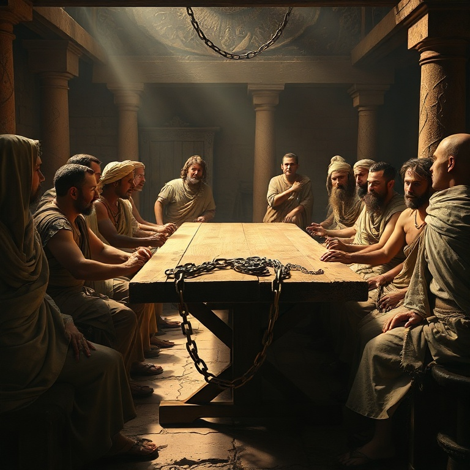
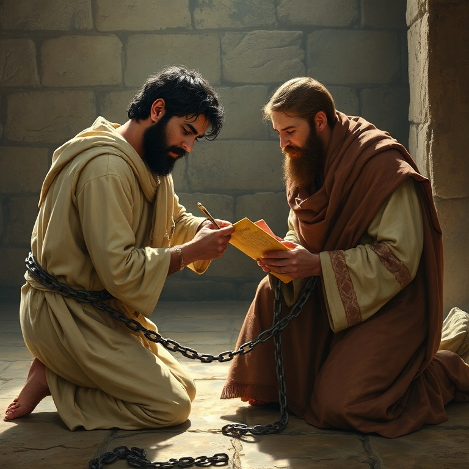

# Amor que Restaura

## Um Estudo na Epístola de Filemom

---

### Índice

1. [Contexto da Escravidão Romana](#1-contexto-da-escravidão-romana)
2. [Paulo e Onésimo](#2-paulo-e-onésimo)
3. [O Apelo do Amor](#3-o-apelo-do-amor)
4. [Perdão e Reconciliação](#4-perdão-e-reconciliação)
5. [Lições de Graça e Igualdade](#5-lições-de-graça-e-igualdade)

---

## Introdução

A carta a Filemom é uma das mais curtas e pessoais do apóstolo Paulo, mas carrega um peso teológico e prático imenso. Escrita por volta de 60-62 d.C., durante o primeiro encarceramento de Paulo em Roma, esta epístola aborda o delicado tema da escravidão à luz do evangelho. Paulo intercede por Onésimo, um escravo fugitivo que se converteu sob seu ministério, e apela a Filemom, seu senhor e também cristão, para recebê-lo não mais como servo, mas como irmão amado. Este estudo revela como o amor de Cristo transforma relacionamentos quebrados e derruba barreiras sociais.

---

## Capítulo 1: Contexto da Escravidão Romana

No primeiro século, estima-se que cerca de um terço da população do Império Romano vivia em condição de escravidão. Os escravos não eram considerados pessoas, mas propriedades — instrumentos vivos sem direitos legais. Podiam ser comprados, vendidos, alugados ou punidos com severidade por seus senhores. A lei romana concedia ao senhor o direito de matar um escravo fugitivo, e a fuga era considerada um crime grave.

Paulo, embora não tenha escrito um tratado contra a escravidão como instituição, plantou as sementes de sua dissolução ao afirmar que em Cristo "não há escravo nem livre" (Gálatas 3:28). Filemom, provavelmente um cidadão abastado da cidade de Colossos, era dono de Onésimo. Sua casa servia como local de reunião da igreja local, indicando que ele era um líder respeitado na comunidade cristã.

A carta de Paulo não apenas desafia Filemom a perdoar Onésimo, mas a recebê-lo como igual na família da fé. Este pequeno documento demonstra como o evangelho opera uma revolução silenciosa, transformando estruturas sociais de dentro para fora pelo poder do amor redentor. O contexto histórico nos ajuda a perceber o quão radical era o pedido de Paulo.

---

## Capítulo 2: Paulo e Onésimo

Onésimo, cujo nome significa "útil", havia se tornado tudo menos útil ao fugir de seu senhor Filemom. Levando consigo possivelmente bens ou dinheiro, ele buscou refúgio na grande metrópole de Roma. Em meio à multidão anônima da capital imperial, Onésimo encontrou Paulo — que estava preso, mas continuava pregando o evangelho.

Não sabemos os detalhes exatos do encontro, mas o resultado é claro: Onésimo foi alcançado pelo evangelho e se tornou filho na fé de Paulo. O apóstolo, agora em idade avançada e preso por sua fé, desenvolveu uma profunda afeição por Onésimo, chamando-o de "meu coração" (Filemom 12). A transformação foi tão genuína que Onésimo passou a servir Paulo em suas necessidades na prisão.

Paulo se viu em um dilema: desejava manter Onésimo consigo, mas reconhecia a necessidade de restituição e reconciliação com Filemom. A decisão de enviá-lo de volta não foi fácil. Onésimo retornava não como escravo fugitivo, mas como irmão transformado, levando consigo esta carta que se tornaria um dos mais belos testamentos do poder reconciliador do evangelho.

---

## Capítulo 3: O Apelo do Amor

O capítulo central desta carta revela a maestria de Paulo em apelar ao amor fraternal. Em vez de exercer sua autoridade apostólica para ordenar que Filemom recebesse Onésimo, Paulo prefere um caminho mais profundo: o apelo baseado no amor. Ele escreve: "Embora tenha em Cristo plena liberdade para ordenar o que convém, prefiro apelar com base no amor" (Filemom 8-9).

Esta abordagem revela a essência do evangelho. O amor não coage; convida. Paulo demonstra que relacionamentos cristãos autênticos são construídos sobre a graça, não sobre imposição. Ele coloca Filemom em uma posição onde sua obediência não é forçada, mas voluntária — uma resposta à graça que ele mesmo recebeu.

O apóstolo também se coloca como fiador: "Se ele te causou algum prejuízo ou te deve algo, lança tudo em minha conta" (Filemom 18-19). Esta é uma bela imagem do que Cristo fez por nós — assumiu nossa dívida e nos reconciliou com o Pai. Paulo não apenas ensina teologia; ele a vive diante de Filemom, oferecendo-se como garantia da restauração de Onésimo.

---

## Capítulo 4: Perdão e Reconciliação

O perdão genuíno envolve custo e vulnerabilidade. Paulo pede a Filemom que receba Onésimo "não como escravo, mas como irmão amado" (Filemom 16). Esta reconciliação transcende a relação senhor-servo e estabelece um novo paradigma: a fraternidade em Cristo.

A carta implica que Filemom deveria perdoar a dívida e restaurar Onésimo à sua posição — não como propriedade, mas como parceiro no evangelho. Este era um chamado radical. Na sociedade romana, perdoar um escravo fugitivo era visto como fraqueza. Paulo estava pedindo a Filemom que desafiasse as normas culturais por um princípio superior: o amor redentor de Cristo.

A reconciliação cristã não ignora o erro, mas o trata com graça. Onésimo havia errado ao fugir, e Paulo não minimiza isso. Ele oferece restituição e pede acolhimento. A beleza deste texto está em sua demonstração prática de como o evangelho restaura relacionamentos quebrados. O perdão não apaga o passado, mas redefine o futuro na perspectiva do amor de Deus.

---

## Capítulo 5: Lições de Graça e Igualdade

A carta a Filemom nos ensina que a graça de Deus é o grande equalizador. Paulo escreve: "Sim, irmão, que eu receba de ti, no Senhor, este benefício. Reanima o meu coração em Cristo" (Filemom 20). A expressão "no Senhor" nivela Filemom e Onésimo em uma posição de igualdade espiritual.

Onésimo, que antes era "inútil", tornou-se "útil" — um jogo de palavras com seu nome. Sua transformação ilustra como o evangelho redime não apenas almas, mas identidades e propósitos. Ele não era mais um fugitivo; era um filho na família de Deus.

Para a igreja contemporânea, esta carta desafia barreiras de classe, etnia e posição social. Se o evangelho transforma um escravo fugitivo em irmão amado, ele também pode transformar nossos relacionamentos mais complicados. O amor que restaura não conhece fronteiras. Filemom nos convida a praticar a graça em ações concretas, não apenas em palavras. A verdadeira fé sempre resulta em reconciliação.

---

## Conclusão

A epístola de Filemom é um microcosmo do evangelho. Nela vemos Paulo como intercessor (figura de Cristo), Onésimo como o pecador perdoado e Filemom como aquele chamado a estender graça. Esta carta nos lembra que o cristianismo não é apenas uma doutrina a ser crida, mas uma vida a ser vivida — uma vida marcada por perdão, reconciliação e amor que restaura. Que possamos, como Filemom, receber aqueles que nos feriram não como devedores, mas como irmãos amados.
