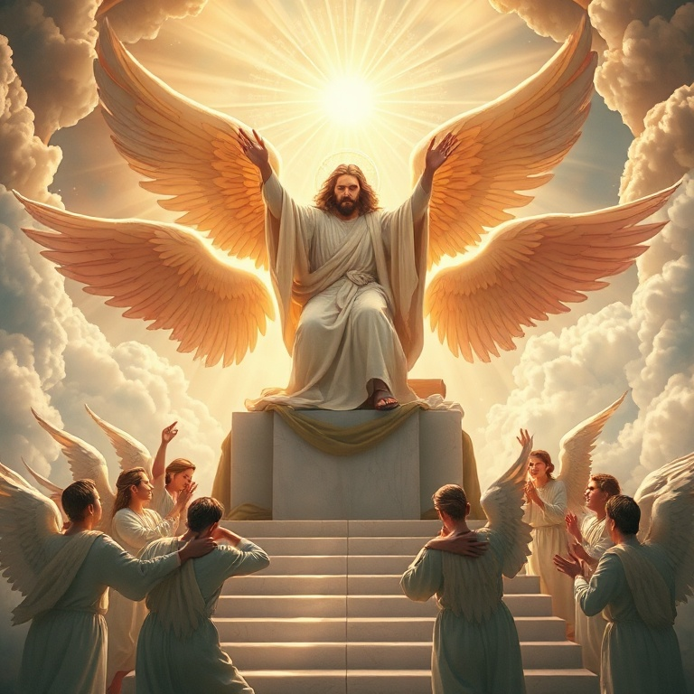
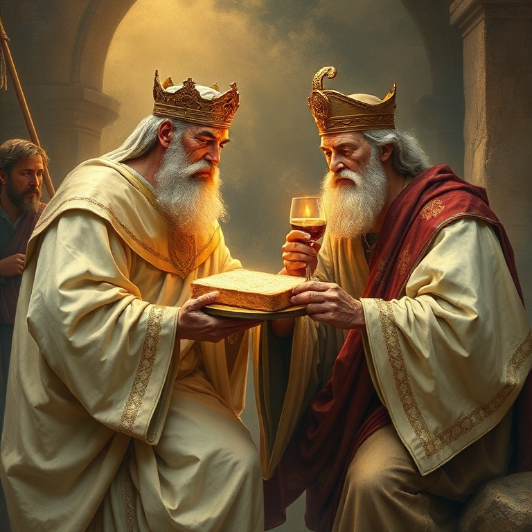

# Superior e Suficiente

## Um Estudo na Epístola aos Hebreus

---

### Índice

1. [Cristo Superior aos Anjos](#1-cristo-superior-aos-anjos)
2. [O Sumo Sacerdote Perfeito](#2-o-sumo-sacerdote-perfeito)
3. [Melquisedeque e a Nova Aliança](#3-melquisedeque-e-a-nova-aliança)
4. [A Fé que Agrada a Deus](#4-a-fé-que-agrada-a-deus)
5. [Corramos com Perseverança](#5-corramos-com-perseverança)

---

## Introdução

A epístola aos Hebreus é um tratado teológico de beleza singular, escrito para uma comunidade cristã judaica que enfrentava perseguições e a tentação de retornar ao judaísmo. Com argumentos sólidos extraídos das Escrituras, o autor — provavelmente Paulo ou um de seus colaboradores — demonstra a supremacia absoluta de Cristo sobre todos os elementos do sistema religioso do Antigo Testamento. Jesus não é apenas superior; ele é suficiente. Este estudo explora as riquezas cristológicas desta carta que exalta Cristo como o centro e cumprimento de toda a revelação divina.

---

## Capítulo 1: Cristo Superior aos Anjos

O autor de Hebreus estabelece imediatamente a superioridade de Cristo. Enquanto os anjos são mensageiros criados, o Filho é o herdeiro de todas as coisas, o resplendor da glória de Deus e a expressão exata do seu Ser (Hebreus 1:2-3). Os anjos ocupavam lugar de destaque na teologia judaica, especialmente por sua mediação na entrega da Lei no Sinai.

Hebreus 1 apresenta sete citações do Antigo Testamento para provar que Cristo é superior aos anjos. Ele é chamado de "Filho", "Deus" e "Senhor" — títulos nunca atribuídos aos anjos. Os anjos são servos; o Filho é o Rei entronizado à destra de Deus.

Esta seção conclui com uma solene advertência: se a palavra falada por anjos (a Lei) era firme e exigia obediência, quanto mais devemos atentar para a salvação anunciada pelo próprio Senhor Jesus? (Hebreus 2:1-4). A superioridade de Cristo implica maior responsabilidade para aqueles que ouvem seu evangelho. Desprezar a Cristo é desprezar o próprio Deus que fala em seu Filho.

---

## Capítulo 2: O Sumo Sacerdote Perfeito

O sistema levítico dependia de sacerdotes humanos que ofertavam sacrifícios repetidos por seus próprios pecados e pelos do povo. Cristo, porém, é apresentado como o Sumo Sacerdote perfeito — santo, inculpável, puro, separado dos pecadores e exaltado nos céus (Hebreus 7:26).

Diferente dos sacerdotes terrenos, Jesus não precisa oferecer sacrifícios diariamente. Ele se ofereceu a si mesmo de uma vez por todas. Seu sacerdócio não é temporário ou limitado pela morte; ele vive para sempre para interceder por nós. A perfeição de Cristo como sacerdote reside em sua dupla natureza: plenamente Deus e plenamente homem.

Hebreus enfatiza que Jesus pode compadecer-se de nossas fraquezas, pois foi tentado em todas as coisas, à nossa semelhança, mas sem pecado (Hebreus 4:15). Esta verdade nos dá confiança para nos aproximar do trono da graça, certos de que encontraremos misericórdia e socorro em tempo oportuno. O sacerdócio de Cristo é a garantia de que temos acesso direto a Deus.

---

## Capítulo 3: Melquisedeque e a Nova Aliança

A figura misteriosa de Melquisedeque — rei de Salém e sacerdote do Deus Altíssimo — é central no argumento de Hebreus. Abraão, o patriarca, pagou-lhe dízimos, demonstrando a superioridade de seu sacerdócio sobre o levítico, pois Levi ainda estava "nos lombos" de Abraão (Hebreus 7:9-10).

O salmo 110:4 declara: "Tu és sacerdote para sempre, segundo a ordem de Melquisedeque". Cristo cumpre esta profecia como sacerdote não por genealogia humana, mas pelo poder de uma vida indestrutível. Seu sacerdócio é eterno e perfeito.

Com base neste sacerdócio superior, Cristo estabelece uma nova aliança, prometida em Jeremias 31: "Porei minhas leis em seus corações e as escreverei em suas mentes" (Hebreus 10:16). A nova aliança é superior porque oferece perdão completo e acesso direto a Deus pelo sangue de Cristo, tornando obsoleto o sistema sacrificial do Antigo Testamento. Não precisamos mais de mediação humana; Cristo é nosso único e suficiente Mediador.

---

## Capítulo 4: A Fé que Agrada a Deus

O capítulo 11 de Hebreus é o grande "salão da fama da fé". Nele, o autor define fé como "a certeza das coisas que se esperam, a convicção de fatos que se não veem" (Hebreus 11:1). A fé não é mero otimismo, mas confiança fundamentada na fidelidade de Deus.

A galeria de heróis começa com Abel, Enoque, Noé e Abraão, seguindo por Isaque, Jacó, José e Moisés. Cada um creu nas promessas de Deus mesmo sem ver seu cumprimento completo. Abraão saiu sem saber para onde ia. Moisés escolheu sofrer com o povo de Deus em vez dos prazeres transitórios do Egito.

O capítulo nos lembra que todos estes "morreram na fé, sem ter recebido as promessas, mas vendo-as de longe" (Hebreus 11:13). Eles confiaram não no que viam, mas no que Deus havia prometido. Esta fé perseverante agrada a Deus, pois "quem se aproxima de Deus deve crer que ele existe e recompensa os que o buscam" (Hebreus 11:6). Somos convidados a seguir o mesmo caminho de confiança.

---

## Capítulo 5: Corramos com Perseverança

Hebreus 12 nos exorta a correr com perseverança a carreira que nos está proposta, "olhando firmemente para o Autor e Consumador da fé, Jesus" (Hebreus 12:2). A vida cristã é comparada a uma maratona que exige resistência, disciplina e foco.

Para correr bem, precisamos abandonar todo peso e pecado que nos embaraça. O autor nos lembra que a disciplina do Senhor é sinal de amor paterno — Deus nos disciplina como filhos para que participemos de sua santidade. O sofrimento não é sinal de abandono, mas de filiação.

O clímax do capítulo nos transporta ao Monte Sião celestial, à Jerusalém celestial, à assembleia dos primogênitos arrolados nos céus. Não nos aproximamos de um monte tremendo (Sinai), mas da graça personificada em Cristo. Esta visão nos fortalece para perseverar, sabendo que receberemos um reino inabalável. Corramos, pois, com os olhos fixos em Jesus, que já venceu e nos aguarda na linha de chegada.

---

## Conclusão

Hebreus nos apresenta um Cristo superior aos anjos, a Moisés, a Arão e a todo sistema sacrificial do Antigo Testamento. Mais que superior, ele é suficiente — suficiente para salvar perfeitamente, suficiente para nos dar acesso direto a Deus, suficiente para nos garantir uma aliança eterna. A resposta adequada a tamanha revelação é a fé perseverante. Que possamos viver à luz desta verdade, correndo com paciência a carreira proposta, certos de que aquele que começou boa obra em nós a completará até o dia de Cristo.
