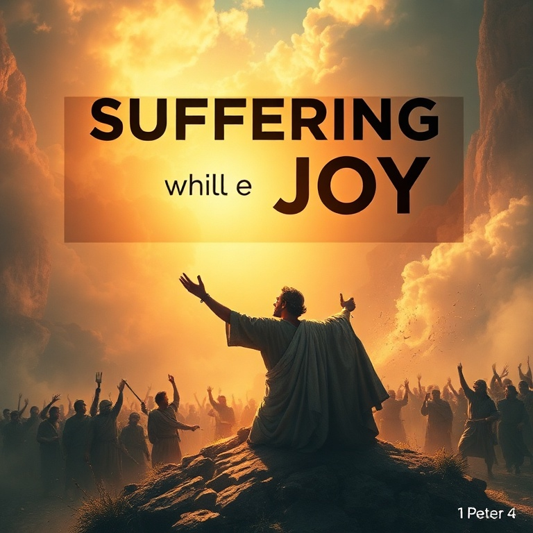

# Esperança Viva no Sofrimento

## Um Estudo na Primeira Epístola de Pedro

---

### Índice

1. [Eleitos para a Glória](#1-eleitos-para-a-glória)
2. [Pedras Vivas](#2-pedras-vivas)
3. [Submissão e Santidade](#3-submissão-e-santidade)
4. [Sofrimento e Alegria](#4-sofrimento-e-alegria)
5. [Vigiai e Orai](#5-vigiai-e-orai)

---

## Introdução

A primeira carta de Pedro foi escrita por volta de 64-65 d.C., às vésperas da intensificação da perseguição imperial sob Nero. Pedro dirige-se a cristãos dispersos na Ásia Menor (atual Turquia), enfrentando hostilidade social, calúnias e discriminação. Mais que uma carta de conforto, esta epístola é um manual teológico sobre o significado do sofrimento cristão. Pedro reinterpreta o sofrimento não como maldição, mas como participação nos sofrimentos de Cristo e meio de graça. Em meio à dor, ele oferece uma esperança viva — a certeza da herança incorruptível reservada nos céus.

---

## Capítulo 1: Eleitos para a Glória

Pedro abre sua carta com uma doxologia: "Bendito seja o Deus e Pai de nosso Senhor Jesus Cristo, que, segundo a sua grande misericórdia, nos regenerou para uma viva esperança pela ressurreição de Jesus Cristo dentre os mortos" (1 Pedro 1:3). Esta esperança não é abstrata, mas viva — fundamentada na ressurreição histórica de Cristo.

Os destinatários são descritos como "eleitos segundo a presciência de Deus Pai, em santificação do Espírito, para a obediência e aspersão do sangue de Jesus Cristo" (1 Pedro 1:2). Esta trinitária declaração revela que a salvação é obra do Deus Triúno. A eleição não é motivo de orgulho, mas de humilde gratidão e responsabilidade.

Pedro exorta os crentes a viverem em santidade: "Sede santos em todo o vosso procedimento, porque escrito está: Sede santos, porque eu sou santo" (1 Pedro 1:15-16). A santidade não é opcional, mas a marca do povo de Deus. Eles foram resgatados da vida vã herdada de seus pais, não com prata ou ouro, mas com o precioso sangue de Cristo. Esta redenção custosa demanda uma vida de reverente temor e amor fraternal ardente.

---

## Capítulo 2: Pedras Vivas

Pedro desenvolve uma rica metáfora eclesiológica: a igreja como um edifício espiritual composto de "pedras vivas". Cristo é a pedra angular, escolhida e preciosa. Aqueles que creem nele não serão envergonhados. Mas para os incrédulos, ele é "pedra de tropeço e rocha de ofensa" (1 Pedro 2:8).

Os crentes são "geração eleita, sacerdócio real, nação santa, povo de propriedade exclusiva de Deus" (1 Pedro 2:9). Esta linguagem, originalmente aplicada a Israel, é agora estendida à igreja. Não há mais distinção entre judeus e gentios; todos os que estão em Cristo formam o verdadeiro povo de Deus.

A identidade do crente determina seu comportamento. Como peregrinos e forasteiros neste mundo, os cristãos devem abster-se dos desejos carnais que guerreiam contra a alma. Pedro os chama a viver de modo exemplar entre os gentios, para que, mesmo sendo difamados, as boas obras glorifiquem a Deus. A santidade pessoal é a melhor apologética. Nosso testemunho público deve ser tão luminoso que até nossos acusadores reconheçam a obra de Deus em nós.

---

## Capítulo 3: Submissão e Santidade

Pedro aborda um tema delicado: a submissão em várias esferas da vida. Ele exorta os cristãos a se submeterem às autoridades humanas, aos senhores e, numa seção notável, às esposas a submeterem-se a seus maridos. A chave para entender esta passagem é que todas as exortações são mútuas e fundamentadas no exemplo de Cristo.

O ponto alto do capítulo é a exortação aos maridos: "Maridos, vivei com vossas mulheres com entendimento, dando honra à mulher como vaso mais frágil, e como sendo elas herdeiras convosco da graça da vida" (1 Pedro 3:7). Pedro eleva a mulher à posição de coerdeira da graça — uma declaração revolucionária em seu contexto cultural.

A seção culmina com a instrução de que todos, sem distinção, sejam "de igual ânimo, compassivos, fraternos, misericordiosos, humildes" (1 Pedro 3:8). A submissão cristã não é servilismo, mas livre escolha de seguir o exemplo de Cristo, que sofreu injustamente e se confiou ao justo Juiz. Quando sofremos por fazer o bem, somos abençoados. Estai sempre preparados para responder com mansidão e temor a todo aquele que perguntar a razão da esperança que há em vós.

---

## Capítulo 4: Sofrimento e Alegria

O sofrimento é tema central desta carta. Pedro instrui os crentes a se armarem com o mesmo pensamento de Cristo: "quem sofre na carne deixa o pecado" (1 Pedro 4:1). O sofrimento tem poder purificador. Ele nos desapega deste mundo e nos faz ansiar pelo vindouro.

Os cristãos não devem estranhar a "fogueira" que surge para os provar, como se algo estranho lhes acontecesse. Pelo contrário, "alegrai-vos na medida em que sois participantes dos sofrimentos de Cristo, para que também na revelação de sua glória vos alegreis com exultação" (1 Pedro 4:12-13). O sofrimento não é sinal de desagrado divino, mas de identificação com Cristo.

Pedro adverte que o juízo começa pela casa de Deus. Se o justo é salvo com dificuldade, qual será o fim dos que desobedecem ao evangelho? Esta perspectiva judiciária não é motivo de medo, mas de santo temor que produz perseverança. Os que sofrem segundo a vontade de Deus devem confiar suas almas ao fiel Criador, praticando o bem. A alegria cristã não depende das circunstâncias, mas da certeza da glória vindoura.

---

## Capítulo 5: Vigiai e Orai

O capítulo final contém exortações específicas aos presbíteros e aos jovens. Aos presbíteros, Pedro — que se identifica como "também presbítero e testemunha dos sofrimentos de Cristo" — exorta que pastoreiem o rebanho de Deus não por constrangimento, mas voluntariamente; não por sórdida ganância, mas de boa vontade; não como dominadores, mas como exemplos.

Aos jovens, ele ordena submissão aos mais velhos e a todos: "revesti-vos de humildade, porque Deus resiste aos soberbos, mas dá graça aos humildes" (1 Pedro 5:5). A humildade é a atmosfera da graça.

O clímax da carta é a poderosa exortação: "Sede sóbrios e vigiai. O diabo, vosso adversário, anda em derredor, como leão que ruge, procurando a quem devorar" (1 Pedro 5:8). A vigilância e a oração são as armas do crente. Pedro conclui com uma promessa: "O Deus de toda a graça, que em Cristo vos chamou à sua eterna glória, depois de haverdes sofrido por um pouco, ele mesmo vos aperfeiçoará, firmará, fortificará e fundamentará" (1 Pedro 5:10). O sofrimento é temporário; a glória, eterna.

---

## Conclusão

Primeira Pedro é uma carta de esperança em meio ao sofrimento. Pedro não oferece soluções fáceis ou promessas de livramento imediato. Em vez disso, ele reinterpreta o sofrimento como participação nos sofrimentos de Cristo, como meio de purificação e como caminho para a glória. Firmados na identidade de povo eleito de Deus, os crentes podem enfrentar qualquer tribulação com alegria, sabendo que sua herança é incorruptível e eterna. Vigiemos, pois, e oremos, confiando no Deus de toda graça.
