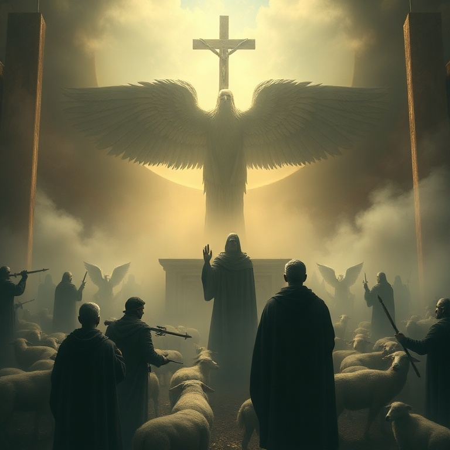

# Batalhai pela Fé — Judas

## Índice

1. [A Urgência da Carta](#1-a-urgência-da-carta)
2. [Exemplos do Passado](#2-exemplos-do-passado)
3. [Falsos Irmãos](#3-falsos-irmãos)
4. [Edificando a Fé](#4-edificando-a-fé)
5. [Guardai-vos no Amor de Deus](#5-guardai-vos-no-amor-de-deus)

---

## Capítulo 1: A Urgência da Carta

Judas, irmão de Tiago e servo de Jesus Cristo, escreve com urgência pastoral. Ele pretendia escrever sobre a salvação comum, mas foi forçado a mudar de assunto porque falsos mestres haviam se infiltrado na igreja. A situação era crítica — a fé que foi entregue aos santos estava sob ataque.

A expressão "fé que uma vez por todas foi entregue aos santos" é fundamental. Judas afirma que o evangelho não está em evolução ou aberto a reinterpretações radicais. Ele foi entregue de uma vez por todas. A tarefa da igreja não é criar nova doutrina, mas guardar e defender o depósito da fé.

Judas escreve com autoridade, mas com humildade — ele se identifica como "servo de Jesus Cristo". Sua preocupação não é sua reputação, mas a pureza do evangelho e a proteção do rebanho. Esta carta é um clamor por vigilância e firmeza em tempos de apostasia.

## Capítulo 2: Exemplos do Passado

Judas usa a história de Israel como advertência. Ele relembra três juízos divinos: o povo libertado do Egito que depois foi destruído por incredulidade; os anjos que abandonaram sua posição e foram presos em trevas; e Sodoma e Gomorra, que sofreram o juízo do fogo eterno por sua imoralidade.

Cada exemplo ilustra um princípio espiritual: privilégio não garante proteção. O povo de Israel viu os milagres do Egito mas pereceu no deserto. Anjos estiveram na presença de Deus mas caíram. Sodoma foi uma cidade próspera que foi consumida pelo fogo. Nenhum privilégio passado nos imuniza contra o juízo presente.

Judas também menciona a profecia de Enoque, mostrando que o juízo divino não é novidade. Deus sempre julgou os ímpios e sempre defenderá os justos. A história não é aleatória — ela se move em direção ao dia do juízo final. Estes exemplos são "tipos" que nos advertem a não repetir os mesmos erros.

## Capítulo 3: Falsos Irmãos

Judas descreve os falsos mestres com linguagem vívida e implacável. Eles são "rochas submersas" em festas fraternais, alimentando-se sem temor. São nuvens sem água, árvores sem fruto, ondas bravias que espumam sua própria vergonha. São estrelas errantes para quem está reservada a escuridão eterna.

A marca destes falsos é a combinação de imoralidade e negação doutrinária. Eles transformam a graça de Deus em libertinagem e negam Jesus Cristo como único Soberano e Senhor. Judas não faz distinção entre erro moral e erro doutrinário — ambos andam juntos. Quem abandona a sã doutrina geralmente abandona também a vida santa.

O julgamento destes homens é certo. Judas cita o exemplo de Coré, que se rebelou contra a autoridade de Moisés e foi engolido pela terra. Falsos mestres sempre surgem, mas sua condenação está selada. A igreja deve identificar, confrontar e rejeitar tais ensinos e tais mestres.

## Capítulo 4: Edificando a Fé

Em meio ao ambiente de juízo e advertência, Judas muda o tom e oferece um caminho positivo: "Edificando-vos na vossa santíssima fé, orando no Espírito Santo." A defesa contra o erro não é apenas negativa (rejeitar falsos mestres), mas positiva (crescer na fé). Uma igreja edificada é uma igreja protegida.

Três elementos formam o alicerce da vida cristã: a fé (o conteúdo da doutrina recebida), o Espírito (o capacitador da vida cristã) e o amor de Deus (o ambiente onde vivemos). Judas conecta o conhecimento doutrinário à experiência espiritual. Fé sem oração é intelectualismo morto; oração sem fé é misticismo vazio.

Judas também chama os crentes a terem misericórdia dos que duvidam e salvarem outros "arrebatando-os do fogo". A batalha pela fé não é apenas defender a verdade, mas resgatar pessoas. Somos chamados a odiar a heresia mas amar os hereges, buscando sua restauração com compaixão e temor.

## Capítulo 5: Guardai-vos no Amor de Deus

Judas conclui com uma das mais belas doxologias do Novo Testamento. Antes de encerrar, ele afirma que Deus é poderoso para nos guardar de tropeçar e nos apresentar irrepreensíveis diante de sua glória. A segurança final do crente está no poder de Deus, não na nossa força. Ele nos guarda, nos preserva e nos apresenta.

A doxologia final exalta o Deus único e Salvador, nosso Senhor Jesus Cristo. A ele seja glória, majestade, domínio e autoridade antes de todos os séculos, agora e para sempre. Judas termina onde tudo começou e terminará: na adoração a Deus.

O chamado de Judas é para que nos guardemos no amor de Deus, esperando a misericórdia de nosso Senhor Jesus Cristo para a vida eterna. A batalha pela fé não termina nesta vida, mas é garantida pela fidelidade daquele que nos chamou. Maranata — o Senhor vem.

---

## Conclusão

A carta de Judas é um chamado urgente à vigilância e à firmeza. Em meio à infiltração de falsos mestres, somos exortados a batalhar pela fé, edificar nossas vidas na verdade e confiar no poder de Deus para nos guardar até o dia final. Soli Deo Gloria.
