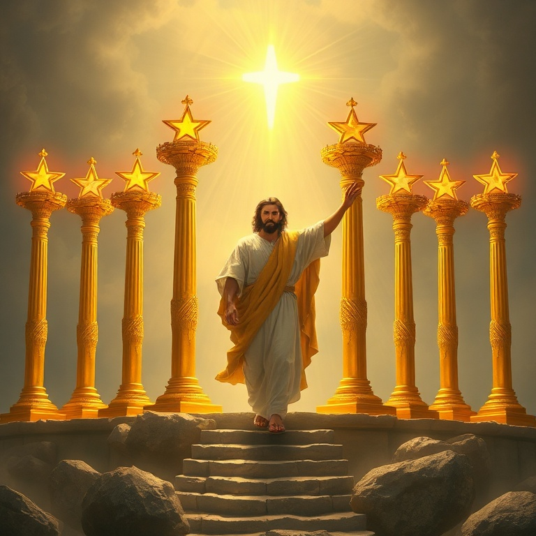
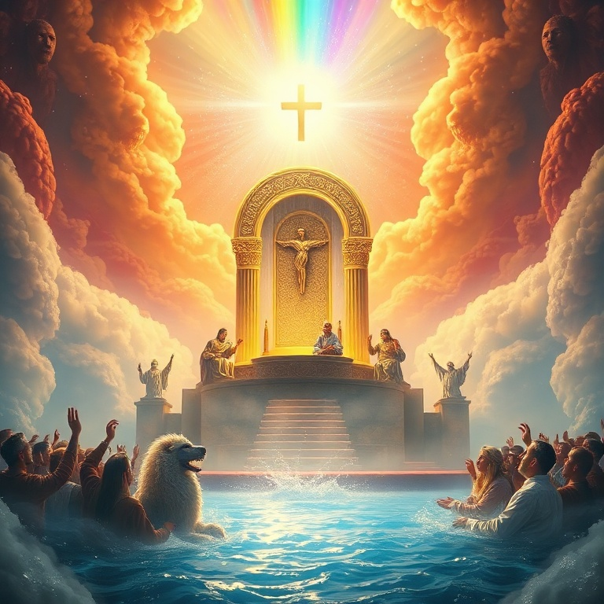
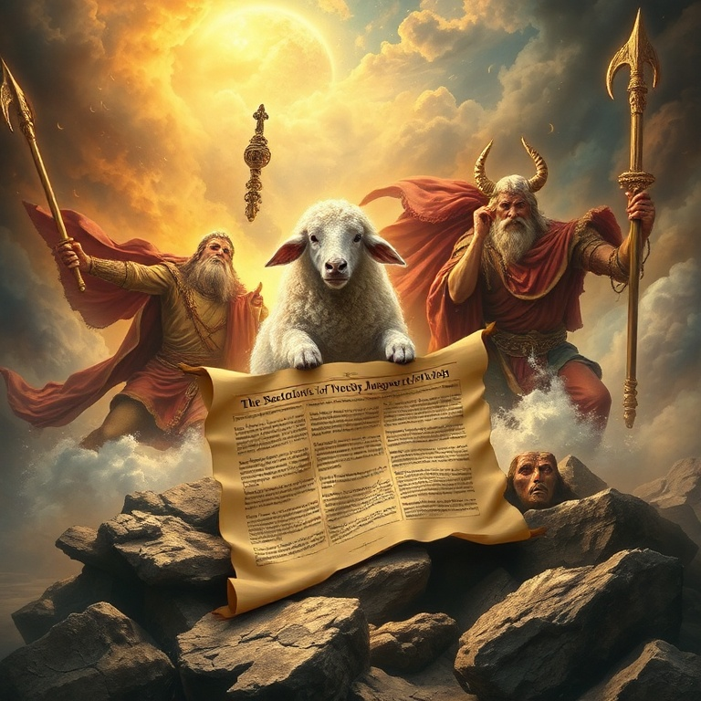
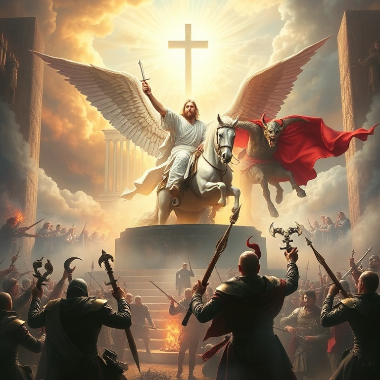
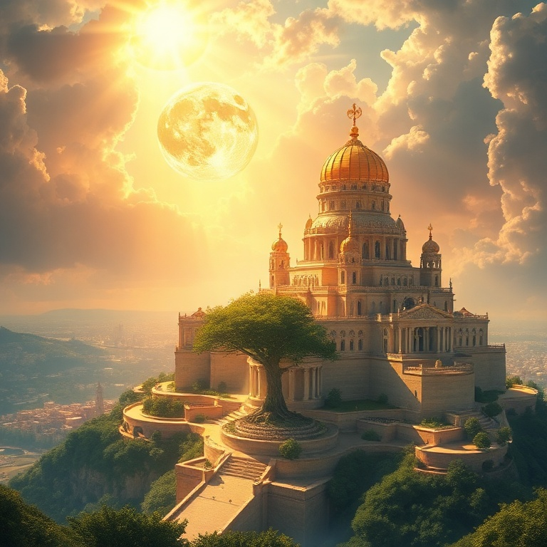

# O Cordeiro Venceu — Apocalipse

## Índice

1. [As Cartas às Sete Igrejas](#1-as-cartas-às-sete-igrejas)
2. [O Trono de Deus e o Cordeiro](#2-o-trono-de-deus-e-o-cordeiro)
3. [Os Selos e as Trombetas](#3-os-selos-e-as-trombetas)
4. [A Grande Batalha Final](#4-a-grande-batalha-final)
5. [Novos Céus e Nova Terra](#5-novos-céus-e-nova-terra)

---

## Capítulo 1: As Cartas às Sete Igrejas

João, exilado na ilha de Patmos, recebe uma visão de Jesus Cristo glorificado. O Senhor aparece no meio de sete candelabros de ouro, segurando sete estrelas em sua mão. Os candelabros representam as sete igrejas da Ásia Menor, e as estrelas, seus anjos. Cristo está presente no meio de sua igreja, conhecendo cada detalhe de sua vida.

Cada carta segue um padrão: Jesus se apresenta com atributos específicos, elogia as virtudes da igreja, repreende falhas quando necessário, exorta ao arrependimento e promete recompensa aos vencedores. Éfeso perdeu seu primeiro amor; Esmirna enfrentava perseguição; Pérgamo tolerava heresias; Tiatira permitia imoralidade; Sardes tinha fama mas estava morta; Filadélfia era fiel; Laodiceia era morna.

As cartas são relevantes não apenas para as igrejas do primeiro século, mas para todas as igrejas de todas as épocas. Jesus anda no meio dos candelabros hoje, vendo nossas obras, conhecendo nossas lutas e chamando-nos à perseverança. A cada igreja, a promessa: "Ao que vencer, lhe darei..."

## Capítulo 2: O Trono de Deus e o Cordeiro

João é arrebatado ao céu e testemunha a cena mais majestosa de toda a Escritura: o trono de Deus. Ao redor do trono há um arco-íris, relâmpagos e trovões. Vinte e quatro anciãos e quatro seres viventes adoram dia e noite aquele que vive para todo o sempre. A criação inteira se prostra em adoração ao Criador.

Então João vê um Cordeiro que parecia ter sido morto. Ele é o único digno de abrir o livro selado com sete selos. Toda a corte celestial explode em louvor: "Digno é o Cordeiro que foi morto de receber poder, riqueza, sabedoria, força, honra, glória e louvor." O Cordeiro venceu e está no centro do trono de Deus.

Esta visão é o coração teológico de Apocalipse. A história não está fora de controle. Deus está no trono, e o Cordeiro que foi morto é o Redentor. A adoração celestial nos lembra que o propósito final de toda a história é a glória de Deus e do Cordeiro. Tudo converge para este ponto central.

## Capítulo 3: Os Selos e as Trombetas

O Cordeiro abre os sete selos, desencadeando os juízos de Deus sobre a terra. Os quatro primeiros selos trazem os quatro cavaleiros: conquista, guerra, fome e morte. O quinto selo revela os mártires que clamam por justiça. O sexto selo descreve catástrofes cósmicas que anunciam o grande dia da ira do Cordeiro.

Antes do sétimo selo, João vê 144 mil selados de Israel e uma multidão incontável de todas as nações vestindo branco. Eles são os que vieram da grande tribulação e lavaram suas vestes no sangue do Cordeiro. O juízo não é o fim da história — a redenção está sempre presente.

As sete trombetas trazem juízos ainda mais intensos: granizo e fogo, o mar se torna sangue, estrelas caem do céu, trevas cobrem a terra, e gafanhotos demoníacos atormentam os ímpios. Ainda assim, os homens não se arrependem. O juízo de Deus é justo, mas também é uma chamada ao arrependimento.

## Capítulo 4: A Grande Batalha Final

O dragão vermelho, Satanás, é expulso do céu e persegue a mulher que deu à luz o Filho. A guerra espiritual se intensifica. Duas bestas surgem: uma do mar (poder político) e outra da terra (falso profeta). Elas enganam as nações e perseguem os santos. O império do mal parece invencível.

Mas então o Cordeiro aparece montado num cavalo branco, seguido pelos exércitos celestiais. Ele derrota a besta e o falso profeta, que são lançados vivos no lago de fogo. Satanás é preso por mil anos e depois lançado no mesmo lago de fogo. A batalha do Armagedom termina com a vitória total de Cristo.

Apocalipse não é sobre o triunfo do mal, mas sobre a vitória certa do Cordeiro. A igreja pode enfrentar perseguição, tribulação e até morte, mas a vitória final é garantida. O sangue do Cordeiro e a palavra do testemunho dos santos são as armas que vencem o dragão.

## Capítulo 5: Novos Céus e Nova Terra

João vê um novo céu e uma nova terra, pois o primeiro céu e a primeira terra passaram. O mar já não existe. A nova Jerusalém desce do céu, da parte de Deus, preparada como uma noiva adornada para seu noivo. Deus habitará com os homens, e eles serão seu povo. Deus enxugará toda lágrima, e não haverá mais morte, luto, pranto ou dor.

A cidade celestial é descrita em detalhes gloriosos: suas muralhas de jaspe, suas portas de pérola, suas ruas de ouro puro. Não há templo, pois o Senhor Deus Todo-Poderoso e o Cordeiro são o templo. Não há sol nem lua, pois a glória de Deus a ilumina. Os redimidos de todas as nações andarão em sua luz.

O livro termina com um convite e uma promessa: "O Espírito e a noiva dizem: Vem!" Jesus testemunha: "Certamente cedo venho." João responde: "Ora, vem, Senhor Jesus!" A igreja espera com esperança ativa o retorno do seu Senhor. Maranata! A história termina não em destruição, mas em novo começo — a eternidade com Deus.

---

## Conclusão

Apocalipse não é um livro de medo, mas de esperança. Ele revela Jesus Cristo em sua glória, o Cordeiro vitorioso que redime seu povo e julga o mal. A mensagem final é clara: Deus vence, o Cordeiro reina, e seu povo habitará com ele para sempre em novos céus e nova terra.
